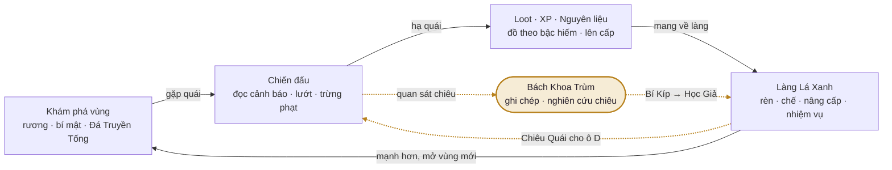
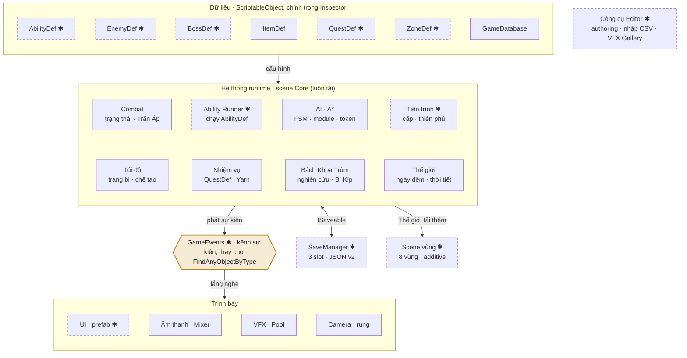
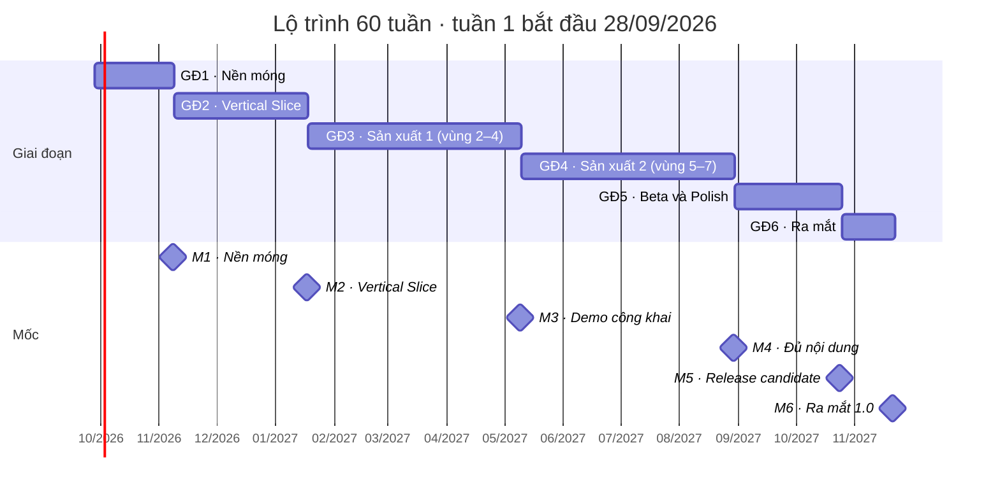

# Kế hoạch phát triển Rừng Thì Thầm

*GDD · v1 · 24.09.2026 · Unity 6000.6 · 2D URP · Prototype → 1.0*

Lộ trình biến bản prototype hiện có (1 vùng, 1 boss, 8 chiêu) thành một action RPG pixel-art hoàn chỉnh: 7 vùng, 10 boss, 36 chiêu thức, khoảng 30 NPC, kèm quy chuẩn visual, VFX và kế hoạch 60 tuần. Mọi con số ở đây là đề xuất ban đầu, sẽ chỉnh lại sau mỗi đợt playtest.

Bản HTML có sơ đồ tương tác và bộ lọc backlog: https://claude.ai/artifact/9g8PZSohsGFxQz1ykcadMe (link riêng tư, cần bật chia sẻ để người khác xem).

**Phạm vi bản 1.0**

| Hạng mục | Số lượng |
|---|---|
| Vùng | 7 + làng |
| Boss (3 boss ẩn) | 10 |
| Mini-boss | 7 |
| Loại quái | 42 |
| Chiêu + Chiêu Quái | 36 + 12 |
| NPC có tên | ~30 |
| Nhiệm vụ | ~60 |
| Vật phẩm | ~260 |
| Thời lượng cốt truyện | 10–12 giờ |
| Team 3 người | 60 tuần |

**Mục lục**

- [01 · Phạm vi & mục tiêu](#pham-vi)
- [02 · Hiện trạng prototype](#hien-trang)
- [03 · Trụ cột & vòng lặp](#tru-cot)
- [04 · Chiến đấu](#chien-dau)
- [05 · Tiến trình & vật phẩm](#tien-trinh)
- [06 · Chiêu thức](#chieu-thuc)
- [07 · Chiêu Quái & Bách Khoa Trùm](#chieu-quai)
- [08 · Nhân vật chính](#nhan-vat)
- [09 · NPC & nhiệm vụ](#npc)
- [10 · Thế giới & vùng](#the-gioi)
- [11 · Quái & boss](#quai-boss)
- [12 · Cốt truyện](#cot-truyen)
- [13 · Visual & VFX](#visual)
- [14 · Giao diện](#giao-dien)
- [15 · Âm thanh](#am-thanh)
- [16 · Kỹ thuật & kiến trúc](#ky-thuat)
- [17 · Lộ trình 60 tuần](#lo-trinh)
- [18 · Backlog](#backlog)
- [19 · Quy trình & chất lượng](#quy-trinh)
- [20 · Rủi ro](#rui-ro)
- [21 · Hai tuần tới](#hai-tuan-toi)

---

<a id="pham-vi"></a>

## 01 · Phạm vi & mục tiêu

Ba tầng phạm vi để lúc nào cũng có một bản chơi được: MVP làm bản demo công khai, 1.0 là mục tiêu phát hành, phần Mở rộng chỉ làm khi 1.0 đã xong.

| Hạng mục | MVP · Demo | Mục tiêu 1.0 | Mở rộng (sau 1.0) |
|---|---|---|---|
| **Vùng** | Làng + 3 vùng đầu | Làng + 7 vùng | Hầm ngục ngẫu nhiên “Rễ Sâu” |
| **Boss** | 4 (3 boss vùng + Vua Slime Hoàng Kim) | 10 (7 boss vùng + 3 boss ẩn), 7 mini-boss | Boss theo mùa |
| **Quái** | 18 loài + Tinh Anh | 42 loài + Tinh Anh | +12 loài cho Rễ Sâu |
| **Chiêu người chơi** | 4 hệ, ~22 chiêu + Lướt | 6 hệ × 6 = 36 chiêu + Lướt (4 Ấn) | Hệ Cung (6 chiêu) |
| **Chiêu Quái (ô D)** | 6 | 12 | +6 |
| **NPC** | 15 | ~30 + đom đóm đồng hành | Thú cưng chiến đấu |
| **Nhiệm vụ** | 25 | ~60 (12 chính, 30 phụ, 10 truy nã, 8 ẩn) | Sự kiện theo mùa |
| **Vật phẩm** | \~110 | \~260, 6 bộ đồ, 6 Huyền Thoại | Bộ đồ mới |
| **Thời lượng** | 3–4 giờ | 10–12 giờ (100%: 20+ giờ) | Ác Mộng+, New Game+ có biến số |
| **Nền tảng** | Windows | Windows (Steam) + Steam Deck | Co-op 2 người cùng máy |
| **Thời gian (team 3)** | ≈ 32 tuần | ≈ 60 tuần | +12–20 tuần |

### Giả định nguồn lực

- **Team:** 1 lập trình kiêm thiết kế game · 1 họa sĩ pixel kiêm VFX · 1 người bán thời gian cho âm thanh, QA và cộng đồng.
- **Nếu làm một mình:** Nhân thời gian lên 1,7–2 lần (≈ 24–28 tháng), hoặc giữ mốc 60 tuần và phát hành bản MVP mở rộng thêm 1–2 vùng.
- **Nền tảng:** Windows qua Steam, đạt chuẩn Steam Deck; chơi được bằng chuột + phím và tay cầm.
- **Ngôn ngữ:** Tiếng Việt là bản gốc; tiếng Anh ở giai đoạn Beta. Mọi chuỗi chữ đi qua hệ thống bản địa hóa ngay từ đầu.
- **Mô hình bán:** Mua một lần (premium), không quảng cáo, không vật phẩm trả phí.

> **Thứ tự cắt giảm khi trễ:** phần Mở rộng → rút gọn vùng 7 thành chuỗi phòng boss → câu cá và nấu ăn → boss ẩn. Không cắt chất lượng của 7 boss chính: đó là trụ cột của game.

<a id="hien-trang"></a>

## 02 · Hiện trạng prototype

Prototype ở `Desktop\RPG` đã chứng minh được cảm giác chiến đấu, VFX và phong cách HUD. Bảng dưới là điểm xuất phát: “Tạm” nghĩa là chạy được nhưng sẽ làm lại theo kiến trúc mới.

| Hệ thống | Trạng thái | Đang có | Cần cho 1.0 |
|---|---|---|---|
| **Di chuyển & camera** | ✓ Xong | 4 hướng, bấm chuột để đi, phím mũi tên, camera bám và lấy nét vào boss | Tay cầm, đổi phím (Input Actions) |
| **Chiến đấu cơ bản** | ✓ Xong | DamageInfo, chí mạng, hit-stop, đẩy lùi, rung màn hình, số sát thương bay | Giáp và kháng, Thanh Trấn Áp, Lướt Hoàn Hảo, input buffer |
| **Hiệu ứng trạng thái** | ◐ Tạm | Choáng, Làm Chậm, Bỏng | 10 trạng thái, cộng dồn tầng, giảm hiệu lực khi lặp |
| **Chiêu thức** | ◐ Tạm | 8 chiêu có VFX riêng, mỗi chiêu một class | Ability System v2 dạng dữ liệu, cấp 1–5, Ấn; 36 chiêu |
| **Quái & AI** | ◐ Tạm | Slime Rêu, Nấm Độc; tuần tra, đuổi, quay về; bãi hồi sinh | EnemyDef, module AI, tìm đường A\*, token tấn công, Tinh Anh; 42 loài |
| **Boss** | ✓ Xong | Gấu Ma Rừng Già: Vồ, Dậm Đất, Ném Đá Lớn, Chụp Quăng, Cuồng Nộ, bị Choáng khi đáp vào Tảng Đá Lớn | BossDef, chuyển phase ở 60%, intro, 9 boss mới |
| **NPC & hội thoại** | ◐ Tạm | Trưởng Làng, Bé Mai, chân dung, thoại tuyến tính | Yarn Spinner, lựa chọn, lịch sinh hoạt; ~30 NPC |
| **Nhiệm vụ** | ◐ Tạm | Chuỗi chính + 1 phụ, tracker “(+1 · Tab)” | QuestDef dạng dữ liệu, 9 loại mục tiêu; ~60 nhiệm vụ |
| **Bách Khoa Trùm** | ◐ Tạm | Tự ghi lại quái và chiêu boss, dòng log, màn hình J | Nghiên cứu → Bí Kíp → học Chiêu Quái vào ô D; mốc thưởng |
| **Túi đồ & loot** | ◐ Tạm | Nhặt đồ, xếp chồng, tooltip, bình 1/2/3 | Trang bị 8 ô, bậc hiếm, dòng thuộc tính, chế tạo |
| **Thế giới** | ◐ Tạm | 1 map 100×64 tile (làng → rừng → đấu trường), minimap, tên khu vực | Scene lõi + 8 scene vùng, Đá Truyền Tống, bản đồ thế giới |
| **Ngày/đêm & ánh sáng** | ✓ Xong | Light2D, lửa trại, đèn lồng; volume Bloom, Vignette, Impact, Danger | Preset ánh sáng cho từng vùng, thời tiết |
| **HUD** | ✓ Xong | Thanh máu boss, orb Máu/Năng lượng, skill bar, log, nameplate, banner | Biểu tượng buff/debuff, Thanh Trấn Áp, chế độ HUD gọn |
| **Âm thanh** | ◐ Tạm | 42 SFX, nhạc rừng, nhạc boss, âm nền (tổng hợp bằng script) | Nhạc phân lớp, mixer, thay bằng âm thanh thật |
| **Art** | ◐ Tạm | Toàn bộ sinh bằng `Tools/ArtGen`, là placeholder có phong cách | Art thật theo style guide; giữ script để làm biến thể màu |
| **Cấp độ & thiên phú** | ○ Chưa có | — | Cấp 1–40, 4 chỉ số, 3 nhánh × 15 nút |
| **Lưu game** | ○ Chưa có | — | 3 slot, tự lưu, JSON có số phiên bản |
| **Menu & cài đặt** | ○ Chưa có | — | Menu chính, cài đặt, đổi phím, tùy chọn hỗ trợ |

### Nợ kỹ thuật phải trả ở giai đoạn 1

- **Chưa có git.** Thư mục RPG chưa phải repo: khởi tạo git + Git LFS (png, wav, aseprite) trước mọi thay đổi khác.
- **`Build Everything` ghi đè** prefab, dữ liệu và scene, nên mọi chỉnh tay đều mất. Cần chế độ authoring: chỉ tạo những gì còn thiếu.
- **UI dựng hoàn toàn bằng code** (`UIBuilder`): chuyển sang prefab để họa sĩ chỉnh trực tiếp.
- **Nhiệm vụ và hội thoại viết cứng** trong script: chuyển sang QuestDef và file Yarn.
- **Mỗi chiêu là một class** kế thừa `SkillDef`: chuyển sang Ability System v2, ghép chiêu từ các khối hiệu ứng.
- **Map dựng bằng code** (`WorldBuilder`) trong một scene duy nhất: các vùng sẽ vẽ tay bằng Tilemap, mỗi vùng một scene.

<a id="tru-cot"></a>

## 03 · Trụ cột thiết kế & vòng lặp

Năm trụ cột dùng để quyết định mọi tính năng: việc nào không phục vụ ít nhất một trụ cột thì đưa xuống phần Mở rộng.

1. **Boss là điểm nhấn**: Mỗi boss là một bài kiểm tra có cơ chế đấu trường riêng, tên chiêu hiện rõ, nhạc và phần kết riêng, như trận Gấu Ma với Tảng Đá Lớn.
2. **Đọc được, né được, trừng phạt được**: Mọi đòn nguy hiểm đều báo trước; mọi đòn lớn đều để lộ sơ hở. Thua là do phán đoán sai, không phải do không nhìn thấy.
3. **Sưu tầm chiêu bằng Bách Khoa Trùm**: Học từ chính quái vật: quan sát, né, hạ gục, nghiên cứu, rồi dùng lại chiêu của chúng ở ô D.
4. **Thế giới nhỏ mà sống**: Làng thay đổi theo tiến độ, NPC có lịch sinh hoạt, ngày/đêm và thời tiết ảnh hưởng tới quái, chiêu và bí mật.
5. **Loot làm đổi lối chơi**: Đồ Huyền Thoại thay đổi cách dùng chiêu (Găng Gấu Ma biến Lướt thành Dậm Đất nhỏ), không chỉ cộng chỉ số.



*Vòng lặp chính (nét liền) đi từ khám phá tới chiến đấu, loot và về làng nâng cấp. Nhánh nét đứt màu vàng là điểm riêng của game: quan sát chiêu quái khi chiến đấu, nghiên cứu trong Bách Khoa Trùm, rồi mang Bí Kíp về Học Giả để học Chiêu Quái cho ô D.*

### 30 giây

Di chuyển → đọc cảnh báo → lướt hoặc đỡ → trừng phạt khi quái hở → nhặt đồ rơi.

### 10 phút

Dọn một bãi quái hoặc một khu → mở rương, tìm bí mật → xong một nhiệm vụ → kích hoạt Đá Truyền Tống.

### 1 giờ

Hết một vùng: mini-boss → boss → nghiên cứu Chiêu Quái → về làng nâng cấp → mở vùng mới.

### Dài hạn

Hoàn thành Bách Khoa Trùm, săn Huyền Thoại và bộ đồ, boss ẩn, độ khó Ác Mộng, New Game+.

<a id="chien-dau"></a>

## 04 · Hệ thống chiến đấu

Nhanh, đọc được và có trọng lượng. Giữ nguyên cảm giác của prototype (combo 3 đòn, hit-stop, rung màn hình) và thêm chiều sâu bằng Thanh Trấn Áp, Lướt Hoàn Hảo, trạng thái cộng dồn và tương tác nguyên tố.

### Công thức sát thương

```text
Sát thương   = Công × Lực chiêu × (1 + Tăng%) × Chí mạng × (1 − Kháng hệ) × ngẫu nhiên 0.95–1.05
Giảm do giáp = Giáp / (Giáp + 50 + 5 × Cấp người đánh)

Công         = Công vũ khí + 1.5 × Sức Mạnh  (đòn vật lý)   hoặc   + 1.5 × Trí Tuệ  (phép)
Chí mạng     5% gốc, +0.25% mỗi điểm Nhanh Nhẹn (tối đa 60%) · nhân 1.8
Kháng hệ     −50% (điểm yếu) đến +75% · mỗi boss có 1 điểm yếu, mở khi nghiên cứu trong Bách Khoa Trùm

Ví dụ  Cầu Lửa 140% · Công 40 → 56 · Nấm Độc yếu Lửa (−30%) → 73 · giáp 10, người đánh cấp 5 → ≈ 64
```

### Nhịp đòn và cảm giác đánh

- **Input buffer:** 150 ms: bấm sớm vẫn được ghi nhận và phát ngay khi đòn trước hết.
- **Hủy đòn:** Lướt hủy được phần hồi của đòn cơ bản sau khung trúng. Mỗi chiêu có “khung cam kết” riêng; Tuyệt kỹ không hủy được.
- **Lướt:** 4.2 m trong 0.16 s, bất tử 0.28 s, hồi 2.2 s (giữ như prototype).
- **Lướt Hoàn Hảo:** Lướt trong 0.15 s trước khi đòn trúng: thời gian chậm còn 35% trong 0.3 s, +15 năng lượng, chiêu tiếp theo trong 1.5 s +30% sát thương, hiện chữ “Hoàn Hảo!”.
- **Hit-stop 3 mức:** 35 ms (đòn thường) · 70 ms (chí mạng, đòn cuối combo) · 120 ms (vỡ Trấn Áp, đòn kết liễu).
- **Năng lượng:** Hồi 3.5/giây, +3 mỗi đòn Q trúng, +15 khi Lướt Hoàn Hảo. Tuyệt kỹ tốn 40.
- **Thanh Trấn Áp:** Boss và Tinh Anh có thanh Trấn Áp (Gấu Ma: 300). Mỗi đòn cộng điểm (Chém Gió 4, Phá Giáp 40, phản công sau Lướt Hoàn Hảo 25). Đầy thì Choáng 3 s và nhận +50% sát thương. Không trúng đòn 2.5 s thì thanh tụt dần; sau mỗi lần vỡ, ngưỡng tăng 25%.
- **Token tấn công:** Tối đa 2 quái cùng vung đòn vào người chơi (Dễ: 1, Khó: 3). Quái chưa có token thì vây quanh, gầm gừ, chờ lượt.

### Hiệu ứng trạng thái

| Trạng thái | Nguồn chính | Tác dụng | Cộng dồn · thời gian | Dấu hiệu nhìn thấy |
|---|---|---|---|---|
| **Bỏng** | Lửa | 30% sát thương đòn gốc mỗi giây | 3 tầng · 3 s, trúng lại thì làm mới | Lửa nhỏ trên đầu, ánh cam |
| **Lạnh → Đóng Băng** | Băng | −12% tốc chạy và tốc đánh mỗi tầng; đủ 4 tầng thì Đóng Băng 1.5 s (boss: 0.6 s + 60 Trấn Áp) | 4 tầng · 4 s | Hơi lạnh, viền xanh; khối băng khi đóng |
| **Tích Điện** | Lôi | Đủ 3 tầng thì phóng điện 80% sang 3 kẻ gần | 3 tầng · 5 s | Tia điện nhỏ quanh thân |
| **Độc** | Độc | 1.5% máu tối đa mỗi giây mỗi tầng | 5 tầng · 6 s | Bong bóng xanh chua |
| **Choáng** | Dậm Đất, vỡ Trấn Áp | Không hành động được | 1–3 s | Sao xoay trên đầu, chữ “Choáng!” |
| **Trói** | Rễ Trói, tơ nhện | Không di chuyển, vẫn đánh và niệm được | 2 s | Rễ cây hoặc tơ quấn chân |
| **Làm Chậm** | Nhiều nguồn | −30% tốc chạy | 2–4 s | Vệt chân mờ |
| **Đẩy Lùi** | Đòn nặng | Đẩy 1–3 m; va tường thì Choáng 0.5 s | Tức thời | Bụi va chạm |
| **Nguyền** | Ám | +15% sát thương nhận vào, −20% sát thương gây ra | 8 s | Ký hiệu xoay trên đầu |
| **Phán Xét** | Thánh Mộc | +20% sát thương nhận từ mọi nguồn | 5 s | Vầng sáng vàng |

*Khống chế lặp lại lên cùng mục tiêu trong 6 s giảm 40% thời gian mỗi lần. Boss miễn khống chế 4 s sau khi hết Choáng.*

### Tương tác nguyên tố & môi trường

| Kết hợp | Kết quả |
|---|---|
| Lửa + cỏ khô, dầu | Cháy lan theo ô, tắt khi gặp nước; dùng để dọn bụi gai và mở lối |
| Lửa + mục tiêu đang Lạnh | Hơi Nước: nổ 120%, làm mù 1 s, xóa Lạnh |
| Lôi + nước, mục tiêu ướt | Điện lan trong vũng nước, +1 Tích Điện mỗi 0.5 s |
| Băng + mặt nước | Đóng băng thành đường đi trong 8 s (giải đố ở Đầm Lầy, Đỉnh Tuyết) |
| Phong + Lửa | Lốc Lửa: vùng cháy rộng gấp đôi |
| Thánh Mộc + Ám | Triệt tiêu nhau: giải Nguyền, xóa Phán Xét |
| Thời tiết mưa | Lửa −20%, Lôi +20%, mọi mục tiêu ngoài trời bị “ướt” |

### Quy tắc cảnh báo đòn

- Đòn gây từ 15% máu người chơi trở lên phải báo trước ít nhất **0.5 s** (độ khó Thường); đòn nhỏ ít nhất **0.35 s**.
- Sau mỗi đòn lớn có ít nhất **0.4 s** hồi chiêu: đó là cửa sổ trừng phạt.
- Bốn lớp cảnh báo: tư thế lấy đà (từ 2 khung hình), vùng trên đất lấp đầy dần theo thời gian, âm báo riêng từng chiêu, tên chiêu trên đầu boss (“Kỹ năng: Dậm Đất”).
- Màu: **đỏ-cam** là vùng sát thương; **đỏ viền trắng nhấp nháy + dấu “!”** là đòn không đỡ được bằng Khiên, phải lướt; **xanh ngọc** là vùng an toàn; **vàng kim mảnh** là vùng chiêu của người chơi, luôn vẽ dưới lớp cảnh báo của địch.
- Không quá 2 cảnh báo lớn chồng nhau và luôn còn ít nhất một lối thoát.
- VFX của người chơi tự mờ 40% khi nằm trên vùng cảnh báo. Có tùy chọn sọc chéo trên vùng nguy hiểm cho người mù màu.

| Chiêu | Cảnh báo | Trúng | Hồi | Ghi chú |
|---|---|---|---|---|
| Vồ | 0.55 s | 0.1 s | 0.45 s | Đòn nhỏ, combo tối đa 2 |
| Vồ · Cuồng Nộ | 0.42 s | 0.1 s | 0.45 s | Dưới 50% máu (bản 1.0: dưới 60%) |
| Dậm Đất | 1.0 s | 0.1 s | 0.55 s | Bán kính 4.2, Choáng 1.2 s; Cuồng Nộ: 2 sóng |
| Chụp Quăng | 1.25 s | 0.1 s | 0.5 s | Cúi 0.5 + bay 0.75, bán kính 2.4; đáp vào Tảng Đá Lớn thì Choáng 2.8 s |
| Chụp Quăng · Cuồng Nộ | 1.10 s | 0.1 s | 0.5 s | Cúi 0.35 + bay 0.75 |

*Nhịp đòn của Gấu Ma lấy từ prototype. Vồ khi Cuồng Nộ (0.42 s) dưới ngưỡng 0.5 s nhưng vẫn hợp lệ vì là đòn nhỏ (~8% máu), theo ngưỡng 0.35 s. Mọi đòn đều có ít nhất 0.45 s hồi để người chơi đánh trả.*

### Độ khó

| Mức | Máu quái | Sát thương quái | Cảnh báo | Token | Khác |
|---|---|---|---|---|---|
| **Dễ** (Truyện) | ×0.8 | ×0.65 | +25% thời gian | 1 | Bình thuốc nạp nhanh hơn |
| **Thường** | ×1 | ×1 | Chuẩn | 2 | Mốc cân bằng chính |
| **Khó** | ×1.3 | ×1.25 | Chuẩn | 3 | Quái dùng combo, nhiều Tinh Anh hơn |
| **Ác Mộng** | ×1.8 | ×1.5 | −10% | 3 | Mở sau khi phá đảo; Tinh Anh 2 affix, boss thêm chiêu, loot +1 bậc |

*Tùy chọn hỗ trợ tách riêng khỏi độ khó: tốc độ game 70–100%, tắt nháy sáng toàn màn hình, tắt rung, sọc cảnh báo, tự nhắm mục tiêu.*

<a id="tien-trinh"></a>

## 05 · Tiến trình nhân vật & vật phẩm

Hai trục tiến trình: nhân vật (cấp, chỉ số, thiên phú, cấp chiêu) và đồ (trang bị, bậc hiếm, chế tạo). Cấp tối đa 40, trùng với cấp của boss cuối.

### Cấp độ & kinh nghiệm

```text
XP để lên cấp tiếp theo = 50 × cấp^1.6
  cấp 1 → 2        50     cấp 5 → 6        657     cấp 10 → 11    1 991
  cấp 20 → 21   6 034     cấp 30 → 31   11 544     cấp 39 → 40   17 566     tổng ≈ 272 000 XP

XP quái     = (8 + 4 × cấp quái) × hệ số    thường 1 · Tinh Anh 4 · mini-boss 15 · boss 40
Chênh cấp   quái thấp hơn từ 5 cấp: 50% XP · từ 8 cấp: 10% XP
Nguồn XP    ~55% hạ quái · ~35% nhiệm vụ · ~10% khám phá (Đá Truyền Tống, Lá Thư Cổ)
Ví dụ       Gấu Ma cấp 6 → (8 + 24) × 40 = 1 280 XP ≈ 1.5 cấp ở cấp 6
```

Mỗi lần lên cấp: **+3 điểm chỉ số**, **+1 điểm thiên phú** và **+1 điểm kỹ năng**, hồi đầy máu, năng lượng và bình thuốc.

### Bốn chỉ số

| Chỉ số | Mỗi điểm cho | Hợp với |
|---|---|---|
| **Sức Mạnh** | +1.5 Công vật lý, +1% Trấn Áp gây ra | Kiếm, nhánh Chiến Binh |
| **Trí Tuệ** | +1.5 Công phép, +3 năng lượng tối đa | Trượng, nhánh Pháp Sư |
| **Nhanh Nhẹn** | +0.25% chí mạng, +0.5% tốc đánh, −0.5% thời gian hồi Lướt | Nhánh Du Hiệp, hệ Ám |
| **Thể Chất** | +10 máu tối đa, +1 giáp, +0.3% kháng mọi hệ | Mọi lối chơi |

```text
Máu tối đa  = 55 + 9 × cấp + 10 × Thể Chất     cấp 6, Thể Chất 4 → 149 (khớp prototype)
Năng lượng  = 45 + 1.5 × cấp + 3 × Trí Tuệ      cấp 6, Trí Tuệ 3 → 63 (khớp prototype)
```

*Tẩy điểm ở Thầy Đồ Uyên: lần đầu miễn phí, các lần sau tốn vàng tăng dần. Áp dụng cho cả điểm chỉ số, thiên phú và kỹ năng.*

### Cây Thiên Phú

3 nhánh, mỗi nhánh 15 nút: 10 nút nhỏ (1 điểm), 4 nút vừa (2 điểm) và 1 nút then chốt (3 điểm, cần 10 điểm trong nhánh). Một nhánh tốn 21 điểm, cả cây 63; người chơi có khoảng 43 điểm (39 từ lên cấp, 4 từ nhiệm vụ) nên chỉ đầy được khoảng 2 nhánh.

#### Chiến Binh

*Sức Mạnh · cận chiến · Trấn Áp*

- +3% sát thương cận chiến
- Đòn cuối combo +20 Trấn Áp
- Hạ quái hồi 2% máu
- Máu dưới 30%: −15% sát thương nhận

**Then chốt · Không Lùi Bước:** không bị Đẩy Lùi khi đang đánh, Trấn Áp gây ra +50%.

#### Pháp Sư

*Trí Tuệ · nguyên tố · năng lượng*

- +3% sát thương phép
- Trạng thái kéo dài +20%
- −8% năng lượng tiêu hao
- Chiêu vùng +15% bán kính

**Then chốt · Dòng Chảy Nguyên Tố:** dùng 3 hệ khác nhau liên tiếp thì chiêu tiếp theo miễn phí và ×1.5 sát thương.

#### Du Hiệp

*Nhanh Nhẹn · chí mạng · Lướt*

- +1% chí mạng
- Lướt hồi nhanh hơn 10%
- Đánh từ sau lưng +15%
- Lướt Hoàn Hảo +10 năng lượng

**Then chốt · Gió Không Hình:** Lướt Hoàn Hảo làm chậm thời gian thêm 0.3 s và hồi ngay một chiêu ngẫu nhiên.

### Học chiêu, cấp chiêu & Ấn

- **Mở hệ** bằng Sách Hệ. Kiếm Thuật và Thánh Mộc có sẵn từ đầu; Hỏa, Băng, Lôi, Ám mở dần theo cốt truyện (xem mục 10).
- **Học chiêu mới** tốn 1 điểm kỹ năng. Tuyệt kỹ cần thêm nhiệm vụ riêng của hệ và cấp 24.
- **Cấp chiêu 1–5:** mỗi cấp +12% lực chiêu và −4% thời gian hồi. Cấp 3 mở Ấn thứ nhất, cấp 5 mở Ấn thứ hai. Ấn đổi cách chiêu hoạt động, không chỉ cộng số.
- **Điểm kỹ năng:** 39 từ lên cấp + 8 Bí Kíp Cổ giấu trong rương ẩn = 47 điểm, đủ học khoảng 14 chiêu và đưa 8 chiêu lên cấp 5. Người chơi phải chọn chiêu chủ lực.

### Trang bị

**8 ô:** Vũ khí · Mũ · Áo · Găng · Ủng · Nhẫn × 2 · Dây Chuyền. Vũ khí quyết định đòn <kbd>Q</kbd>: **Kiếm** là combo 3 đòn Chém Gió (theo Sức Mạnh), **Trượng** bắn 3 cầu phép (theo Trí Tuệ). Đổi vũ khí được khi ngoài chiến đấu.

| Bậc | Dòng thuộc tính | Nguồn chính | Tỉ lệ rơi |
|---|---|---|---|
| Thường | 0–1 | Quái, rương thường | 70% |
| Khá | 1–2 | Quái, cửa hàng | 22% |
| Hiếm | 2–3 | Tinh Anh, rương khóa | 7% |
| Sử Thi | 3–4 + 1 dòng đặc biệt | Mini-boss, Tinh Anh | 0.9% |
| Huyền Thoại | 2 dòng + hiệu ứng riêng | Boss (chắc chắn ở lần hạ đầu), rèn từ Lõi Boss | 0.1% |
| Bộ | 2 dòng + thưởng bộ 2/4 món | Boss ẩn, chuỗi nhiệm vụ | — |

*Tỉ lệ rơi tính cho quái thường. Màu bậc hiếm theo quy ước quen thuộc của thể loại và luôn đi kèm tên bậc.*

***Dòng thuộc tính:** Công, chí mạng, sát thương chí mạng, tốc đánh, máu, giáp, kháng hệ, hồi năng lượng, giảm hồi chiêu, +% sát thương theo nhãn chiêu (#Lửa, #Đạn, #Vùng…), tốc chạy, hút máu, Trấn Áp.*

#### Huyền Thoại tiêu biểu

| Tên | Ô | Nguồn | Hiệu ứng |
|---|---|---|---|
| Găng Gấu Ma | Găng | Gấu Ma Rừng Già | Cuối mỗi lần Lướt dậm một Dậm Đất nhỏ (bán kính 2), Choáng 0.5 s; hồi 6 s |
| Nanh Xà Mẫu | Nhẫn | Xà Mẫu Đầm Lầy | Độc cộng tới 10 tầng; mục tiêu đầy tầng thì nổ độc lan sang kẻ gần |
| Mắt Nhện Chúa | Dây Chuyền | Nhện Chúa Pha Lê | Chiêu dạng đạn phản xạ 1 lần khi chạm tường |
| Ủng Gió Hú | Ủng | Thủ Lĩnh Hắc Phong | Lướt Hoàn Hảo hồi ngay Lướt và +30% tốc chạy trong 3 s |
| Áo Tim Băng | Áo | Băng Long Ngủ Đông | Máu xuống dưới 30%: tự đóng băng 2 s (bất tử, hồi 20% máu); hồi 90 s |
| Trượng Phượng Hoàng | Vũ khí | Phượng Hoàng Xích Hỏa | Cầu Lửa thành chim lửa tự dẫn; hạ kẻ địch bằng Lửa hồi 2 năng lượng |

### Bình thuốc (nạp lại được)

- **Bình Máu** <kbd>1</kbd>: 3 lượt (tối đa 6), hồi 40% máu. **Bình Năng Lượng** <kbd>2</kbd>: 2 lượt (tối đa 4), hồi 50% năng lượng. Nạp đầy ở Đá Truyền Tống và Quán Trọ, thay cho bình tiêu hao của prototype.
- **Thuốc Thảo Mộc** <kbd>3</kbd>: vật phẩm tiêu hao, chế ở Bà Lang Tư; giải Độc, Lạnh, Bỏng và hồi 15% máu trong 5 s.
- Uống mất 0.6 s, có thể bị ngắt, không uống được khi đang Choáng: hồi máu cũng là một quyết định chiến thuật.
- **14 Hạt Sinh Mệnh** giấu trong thế giới: mỗi 2 hạt đổi 1 nâng cấp ở Bà Lang Tư (+1 lượt bình hoặc +10% lượng hồi).

### Trạm chế tạo

| Trạm | NPC | Chức năng |
|---|---|---|
| **Lò Rèn** | Thợ Rèn Đại Hùng | Nâng cấp đồ +1 → +10 bằng quặng; tách đồ thành nguyên liệu; rèn Huyền Thoại từ Lõi Boss (bậc cao ở Lò Đỏ, Núi Lửa) |
| **Nhà Thuốc** | Bà Lang Tư | Chế Thuốc Thảo Mộc, thuốc giải, thuốc kháng hệ; nâng cấp bình bằng Hạt Sinh Mệnh |
| **Bếp Quán Trọ** | Cô Liên | Nấu 15 món ăn (buff 10 phút, mỗi lúc một món) từ thịt săn, cá, rau vườn |
| **Bàn Khảm Ngọc** | Người Đúc Ngọc Lam | Khảm ngọc vào 1–2 lỗ; ghép 3 ngọc thành 1 ngọc bậc cao hơn |
| **Bàn Khắc** | Phù Thủy Đầm | Khắc lại 1 dòng thuộc tính, giá tăng dần mỗi lần |
| **Vườn** | Chú Hòa | Trồng thảo dược, thu hoạch sau 1–3 ngày trong game |

### Danh mục ~260 vật phẩm

| Nhóm | Số lượng | Ghi chú |
|---|---|---|
| Vũ khí | 36 | Kiếm 18 · Trượng 18, trải theo bậc hiếm và cấp vùng |
| Giáp (mũ, áo, găng, ủng) | 56 | 14 món mỗi ô |
| Trang sức (nhẫn, dây chuyền) | 24 | Nhiều dòng theo nhãn chiêu để dựng build |
| Bộ đồ | 26 | 6 bộ × 4–5 món: Trinh Sát, Hoàng Kim, Tham Lam, Hắc Phong, Học Giả, Vô Danh |
| Bình, thuốc, món ăn | 24 | 3 bình · 6 thuốc · 15 món ăn |
| Nguyên liệu | 40 | Phần quái 18 · thảo dược 8 · quặng 6 · cá 8 |
| Ngọc khảm | 18 | 6 loại × 3 bậc |
| Sách & Bí Kíp | 24 | 4 Sách Hệ · 12 Bí Kíp Chiêu Quái · 8 Bí Kíp Cổ (+1 điểm kỹ năng) |
| Vật phẩm nhiệm vụ, chìa khóa | 12 | Không bán, không vứt được |
| **Tổng** | **260** | Chưa tính 40 Lá Thư Cổ (sưu tầm, lưu trong sổ riêng) |

### Kinh tế vàng

- **Nguồn:** Quái (ít), rương, bán đồ, nhiệm vụ, bảng truy nã, Vua Slime Hoàng Kim.
- **Chỗ tiêu:** Nâng cấp đồ (chính), khắc lại dòng, học Chiêu Quái, thuốc, công thức nấu ăn, tẩy điểm.
- **Mục tiêu cân bằng:** Trước mỗi boss vùng, người chơi đủ vàng cho khoảng 70% số nâng cấp muốn làm, để luôn phải chọn ưu tiên.

<a id="chieu-thuc"></a>

## 06 · Chiêu thức

36 chiêu chia 6 hệ, mỗi hệ 5 chiêu thường và 1 Tuyệt kỹ, trộn hệ tự do. Mỗi chiêu có cấp 1–5 và 2 Ấn (mở ở cấp 3 và 5). Nhãn (có sẵn) là chiêu đã chạy trong prototype, sẽ chuyển sang hệ thống mới.

### Ability System v2: chiêu là dữ liệu

Mỗi chiêu là một `AbilityDef` (ScriptableObject) ghép từ các khối hiệu ứng đặt trên một dòng thời gian. Người chơi và quái dùng chung hệ thống, nên chiêu của boss cũng chính là Chiêu Quái mà người chơi học được sau này. Thêm một chiêu mới không cần viết code, trừ các cơ chế thật đặc biệt.

- **Khối hiệu ứng:** Projectile (xuyên, nảy, tự dẫn) · AreaDamage (vòng, có trễ) · Cone · Chain · Beam (kênh) · Dash / Blink · Buff / Debuff · Heal / Shield · Summon · Zone (vùng bền trên đất) · Trap · Mark / Detonate · Knockback / Pull · Cue (VFX, SFX, rung, chậm thời gian).
- **Nhãn:** Hệ (#Lửa, #Băng…) và dạng (#Cận, #Đạn, #Vùng, #Kênh, #Triệu hồi, #Dịch chuyển). Thiên phú và trang bị đọc nhãn, ví dụ “+20% sát thương chiêu #Đạn”.
- **Nhắm:** Theo hướng chuột, vị trí chuột, bản thân, hoặc tự nhắm (tay cầm, tùy chọn hỗ trợ).

```text
AbilityDef  cau_lua  “Cầu Lửa”                                   nhãn  #Lửa #Đạn
  hồi 3.0 s · năng lượng 12 · niệm 0.18 s · cam kết 0.12 s · nhắm theo hướng chuột
  timeline
    0.00  Anim        cast_hand
    0.18  Projectile  tốc độ 11 · bán kính 0.35 · xuyên 0
            khi trúng → AreaDamage  r 1.5 · lực 140% · Bỏng ×1 · Trấn Áp 10
            khi trúng → Cue         vfx_hoa_cau_lua_no · sfx_no_lua · rung 0.15
  cấp       lực +12%/cấp · hồi −4%/cấp
  Ấn        cấp 3  “Tam Hỏa”   3 đạn hình quạt, mỗi đạn 60%
            cấp 5  “Hỏa Bạo”   nổ lan sang kẻ đang Bỏng
```

### Bố cục phím

| Phím | Ô | Ghi chú |
|---|---|---|
| <kbd>Q</kbd> | Đòn cơ bản | theo vũ khí: Kiếm hoặc Trượng |
| <kbd>W</kbd> | Chiêu 1 | chiêu thường bất kỳ |
| <kbd>E</kbd> | Chiêu 2 | chiêu thường bất kỳ |
| <kbd>R</kbd> | Tuyệt kỹ | 40 năng lượng |
| <kbd>A</kbd> | Chiêu 3 | chiêu thường bất kỳ |
| <kbd>S</kbd> | Chiêu 4 | chiêu thường bất kỳ |
| <kbd>D</kbd> | Chiêu Quái | học từ Bách Khoa Trùm |
| <kbd>Space</kbd> | Lướt | bất tử 0.28 s |

*Giữ đúng bố cục Q W E R A S · D · Space như bản tham khảo. Đổi chiêu khi ngoài chiến đấu hoặc ở Đá Truyền Tống. Tay cầm: 4 nút mặt + 2 cò, giữ cò trái để sang trang chiêu thứ hai.*

### Kiếm Thuật

*Hệ Phong, Vật lý · Sức Mạnh · cận chiến, Trấn Áp cao, dễ chơi nhất · hệ khởi đầu*

| Chiêu | Hiệu ứng (cấp 1) | Hồi · NL | Ấn | VFX |
|---|---|---|---|---|
| **Chém Gió (có sẵn)**<br>*Đòn Q khi cầm Kiếm* | Combo 3 đòn (100 / 100 / 140%); đòn 3 phóng lưỡi gió 3 m; +3 năng lượng mỗi đòn trúng | 0.42 s · 0 | **C3** Gió Xoáy: lưỡi gió xuyên mục tiêu<br>**C5** Nhất Kiếm: đòn 3 luôn chí mạng lên kẻ đang Choáng | Vệt chém bạc 3 khung, lưỡi gió xanh ngọc mờ, cỏ bay |
| **Trảm Nguyệt**<br>*Cận chiến · vùng* | Chém vòng cung 220° trước mặt, 180%, đẩy lùi nhẹ, 12 Trấn Áp | 5 s · 10 | **C3** Trăng Khuyết: chém ngược lại lần hai 60%<br>**C5** Trăng Máu: hồi 3% máu mỗi kẻ trúng | Lưỡi liềm trăng lõi trắng viền xanh ngọc, vết cắt trên đất |
| **Đột Kích**<br>*Lướt tấn công* | Lao 5 m, 150% cho mọi kẻ trên đường, bất tử khi lao | 7 s · 14 | **C3** Truy Phong: trúng địch hoàn 50% thời gian hồi<br>**C5** Song Kích: dùng lại lần hai trong 2 s | 4 bóng mờ nối đuôi, vệt gió thẳng, lóe sáng khi xuyên qua |
| **Bão Kiếm (có sẵn)**<br>*Vùng quanh thân · kênh* | Xoay kiếm 2.5 s, 6 nhịp × 45%, tốc chạy −30% khi xoay | 10 s · 20 | **C3** Mắt Bão: hút quái vào tâm<br>**C5** Cuồng Phong: kết thúc bằng sóng gió 200% | Vòng lưỡi kiếm quay 8 khung, lá bị cuốn, vòng gió trên đất, Light2D xanh ngọc |
| **Phá Giáp**<br>*Cận chiến · đơn mục tiêu* | Đâm mạnh 220%, giảm 25% giáp mục tiêu trong 6 s, 40 Trấn Áp | 8 s · 12 | **C3** Xuyên Tâm: bỏ qua 30% giáp<br>**C5** Vỡ Vụn: ×2 sát thương lên kẻ đang Choáng | Tia đâm ngắn, mảnh giáp kim loại văng, chữ “Phá Giáp!” |
| **Vạn Kiếm Quy Tông**<br>*Tuyệt kỹ · vùng lớn* | 24 thanh kiếm sáng rơi xuống vùng 6 m trong 2 s (mỗi thanh 60%), cuối cùng hội tụ nổ 300% | 60 s · 40 | **C3** Kiếm Trận: để lại trận kiếm 4 s làm chậm<br>**C5** Quy Tông: thanh cuối hút kẻ địch vào tâm | Trận đồ vàng trắng trên đất, kiếm có vệt sáng, nổ trắng, zoom nhẹ + tách màu |

### Hỏa

*Hệ Lửa · Trí Tuệ · sát thương theo thời gian, nổ lan, khống chế vùng · mở sau khi hạ Gấu Ma*

| Chiêu | Hiệu ứng (cấp 1) | Hồi · NL | Ấn | VFX |
|---|---|---|---|---|
| **Cầu Lửa (có sẵn)**<br>*Đạn · nổ* | Cầu lửa nổ bán kính 1.5 m, 140% + 1 tầng Bỏng | 3 s · 12 | **C3** Tam Hỏa: 3 đạn hình quạt, mỗi đạn 60%<br>**C5** Hỏa Bạo: nổ lan sang kẻ đang Bỏng | Lõi vàng trắng HDR, đuôi lửa, ánh sáng bay theo, vòng nổ + vết cháy |
| **Tường Lửa**<br>*Vùng bền* | Tường lửa dài 5 m trong 4 s, 35% mỗi 0.5 s + Bỏng | 12 s · 18 | **C3** Vòng Lửa: tường thành vòng quanh bản thân<br>**C5** Lửa Nuốt: đốt cháy đạn địch bay qua | Cột lửa lặp, tàn lửa bay lên, méo nhiệt, ánh cam trên đất |
| **Hỏa Ấn**<br>*Đánh dấu · kích nổ* | Đặt ấn lên kẻ địch; sau 3 s hoặc khi trúng chiêu Lửa khác thì nổ 250% | 8 s · 14 | **C3** Lây Lan: ấn nhảy sang kẻ gần khi nổ<br>**C5** Nổ Dây Chuyền: vụ nổ kích các ấn khác | Vòng triện xoay trên đầu mục tiêu, nhấp nháy đếm ngược, nổ chữ thập |
| **Hơi Thở Rồng**<br>*Kênh · hình nón* | Phun lửa 1.8 s, nón 60° dài 4 m, 30% mỗi 0.15 s | 14 s · 22 | **C3** Rồng Xanh: lửa xanh +25% sát thương, không gây Bỏng<br>**C5** Thiêu Rụi: để lại thảm lửa 3 s | Dòng lửa mạnh, bóng đầu rồng mờ trước miệng, ánh sáng chập chờn, khói |
| **Liệt Hỏa Bộ**<br>*Lướt · để lại vệt* | Lướt 4 m để lại vệt lửa 3 s (40% mỗi 0.5 s) | 9 s · 12 | **C3** Bước Lửa: 2 lần dùng<br>**C5** Phượng Vũ: cuối vệt nổ cánh phượng 160% | Dấu chân lửa, vệt cháy trên đất, bóng lửa của nhân vật |
| **Thiên Thạch Giáng**<br>*Tuyệt kỹ · vùng mục tiêu* | Sau 1 s thiên thạch rơi, bán kính 4 m, 500% + 3 tầng Bỏng + Choáng 1 s | 60 s · 40 | **C3** Mưa Sao Băng: thêm 5 mảnh nhỏ rơi quanh<br>**C5** Lõi Nóng Chảy: để lại hố dung nham 5 s | Vòng vàng lớn dần trên đất, thiên thạch đuôi lửa HDR, sóng xung kích méo hình, rung mạnh |

### Băng

*Hệ Băng · Trí Tuệ · làm chậm, đóng băng, phòng thủ; mạnh với boss nhờ Trấn Áp · mở ở Đầm Lầy Sương Mù*

| Chiêu | Hiệu ứng (cấp 1) | Hồi · NL | Ấn | VFX |
|---|---|---|---|---|
| **Mũi Băng (có sẵn)**<br>*Đạn xuyên* | Mũi băng xuyên 2 mục tiêu, 120% + 2 tầng Lạnh | 6 s · 15 | **C3** Băng Tỏa: vỡ thành 5 mảnh ở mục tiêu cuối<br>**C5** Hàn Tâm: luôn chí mạng lên kẻ đang Đóng Băng | Tinh thể xoay, vệt sương trắng, mảnh băng lấp lánh khi vỡ |
| **Băng Tiễn**<br>*Đạn nhanh* | 3 mũi tên băng liên tiếp, mỗi mũi 50% + 1 tầng Lạnh | 4 s · 10 | **C3** Liên Châu: 5 mũi<br>**C5** Truy Hàn: mũi tên tự dẫn | Vệt sáng xanh mảnh, hoa tuyết nhỏ khi trúng |
| **Giáp Sương**<br>*Hỗ trợ · khiên* | Khiên băng hấp thụ 20% máu tối đa trong 6 s; kẻ đánh cận chiến bị Lạnh | 18 s · 16 | **C3** Phản Hàn: khiên vỡ thì nổ Lạnh 3 m<br>**C5** Hàn Thể: miễn Làm Chậm, Đóng Băng khi còn khiên | Lớp tinh thể lục giác (fresnel), hơi lạnh, vỡ vụn khi hết |
| **Ngục Băng**<br>*Khống chế vùng* | Sau 0.6 s cột băng mọc trong vùng 2.5 m: 180% + Đóng Băng 2 s (boss: đủ 4 tầng Lạnh) | 15 s · 22 | **C3** Ngục Đôi: 2 lần dùng<br>**C5** Vỡ Ngục: đập vỡ ngục gây 300% | Vòng sương trên đất, cột băng mọc 6 khung, ánh xanh lạnh |
| **Bão Tuyết**<br>*Vùng bền* | Bão tuyết 4 m trong 5 s: 25% mỗi 0.5 s, +1 tầng Lạnh mỗi giây | 20 s · 26 | **C3** Mắt Bão Tuyết: bão đi theo người chơi<br>**C5** Tuyết Lở: kết thúc làm Đóng Băng mọi kẻ bên trong | Tuyết xoáy 2 lớp, sương mặt đất, chỉnh màu lạnh cục bộ |
| **Kỷ Băng Hà**<br>*Tuyệt kỹ · quanh thân* | Mặt đất 8 m quanh thân đóng băng: 400% + Đóng Băng 3 s (boss: 1.5 s + 100 Trấn Áp) | 70 s · 40 | **C3** Vĩnh Đông: băng giữ lại 6 s làm địch trượt, chậm<br>**C5** Tuyệt Đối Linh Độ: kẻ dưới 15% máu vỡ vụn ngay (trừ boss) | Sóng băng lan tròn (mask shader), mặt đất phản chiếu, viền màn hình phủ sương |

### Lôi

*Hệ Lôi · Trí Tuệ + Nhanh Nhẹn · chuỗi, dịch chuyển, tốc độ cao, cộng dồn Tích Điện · mở ở Hang Pha Lê*

| Chiêu | Hiệu ứng (cấp 1) | Hồi · NL | Ấn | VFX |
|---|---|---|---|---|
| **Xích Lôi**<br>*Chuỗi* | Tia sét nhảy 4 mục tiêu, 90% (giảm 15% mỗi lần nhảy), +1 Tích Điện | 4 s · 12 | **C3** Xích Dài: nhảy 7 lần<br>**C5** Quá Tải: mục tiêu đủ 3 Tích Điện nổ ngay | Tia zigzag rung mỗi khung, lóe sáng tại từng điểm, Light2D nhấp nháy |
| **Thiểm Bộ**<br>*Dịch chuyển* | Dịch chuyển 6 m, để lại cầu điện nổ sau 0.5 s (120%) | 8 s · 10 | **C3** Song Thiểm: 2 lần dùng<br>**C5** Lôi Tàng: đòn tiếp theo sau khi dịch chuyển +60% | Nhân vật tan thành tia điện, tia nối hai điểm, tia lửa điện |
| **Lôi Cầu**<br>*Đạn chậm · kích nổ* | Cầu điện bay chậm, giật kẻ trong 2 m 40% mỗi 0.3 s; bấm lại để kích nổ 250% | 10 s · 18 | **C3** Cầu Đôi: 2 quả<br>**C5** Từ Trường: cầu hút kẻ địch lại gần | Cầu plasma (shader nhiễu), tia nhỏ bắn sang kẻ gần, nổ điện |
| **Điện Trường**<br>*Vùng bền* | Vòng điện 3 m trong 5 s: địch bị giật 30% mỗi 0.5 s và chậm 20%; người chơi trong vòng +15% tốc chạy | 16 s · 20 | **C3** Lồng Sét: địch không ra khỏi vòng được<br>**C5** Cộng Hưởng: chiêu Lôi trong vòng hồi nhanh hơn 30% | Vòng rune điện trên đất, tia điện ngẫu nhiên, hạt nhảy |
| **Lôi Ấn**<br>*Cường hóa vũ khí* | Vũ khí nhiễm điện 8 s: mỗi đòn Q phóng thêm tia 35% + 1 Tích Điện | 18 s · 14 | **C3** Lôi Tốc: +20% tốc đánh<br>**C5** Thiên Lôi: cứ 5 đòn gọi một tia sét 200% | Tia điện quấn vũ khí, vệt chém đổi sang tím trắng |
| **Lôi Phạt (có sẵn)**<br>*Tuyệt kỹ · vùng mục tiêu* | 5 tia sét trời liên tiếp, mỗi tia 160% + Choáng 0.8 s. Prototype là 16 s · 28; lên Tuyệt kỹ thì thành 40 s · 40 | 40 s · 40 | **C3** Cửu Thiên: 9 tia<br>**C5** Sấm Truy: tia sét tự tìm kẻ có Tích Điện | Mây đen phủ màn, tia sét dọc HDR, lóe trắng 1 khung (tắt được), đất cháy xém |

### Thánh Mộc

*Hệ Thánh Mộc · Trí Tuệ + Thể Chất · hồi máu, khiên, khống chế nhẹ, triệu hồi; hệ cứu nguy · có từ đầu*

| Chiêu | Hiệu ứng (cấp 1) | Hồi · NL | Ấn | VFX |
|---|---|---|---|---|
| **Hồi Phục (có sẵn)**<br>*Hồi máu* | Hồi 25% máu tối đa trong 3 s | 14 s · 18 | **C3** Suối Nguồn: hồi thêm 20 năng lượng<br>**C5** Tái Sinh: máu dưới 30% thì hồi gấp đôi | Lá xanh xoáy lên, hạt sáng vàng lục, vòng hoa dưới chân, số hồi máu xanh |
| **Khiên Thánh (có sẵn)**<br>*Khiên* | Chặn mọi sát thương 1.2 s, sau đó hấp thụ 15% máu trong 4 s (không chặn đòn có dấu “!”) | 16 s · 16 | **C3** Phản Quang: phản 50% sát thương đã chặn<br>**C5** Thánh Vực: khiên cho cả đom đóm và vật triệu hồi | Vòm sáng vàng lục giác, gợn sóng khi trúng, vỡ thành lông vũ ánh sáng |
| **Rễ Trói**<br>*Khống chế* | Rễ cây mọc trong vùng 3 m, Trói 2 s, 80% | 12 s · 14 | **C3** Gai Độc: rễ gây 2 tầng Độc<br>**C5** Rừng Siết: kẻ bị Trói nhận +25% sát thương | Rễ mọc từ đất (flipbook), lá rơi, bụi đất |
| **Tinh Linh Rừng**<br>*Triệu hồi* | 2 tinh linh bay theo 12 s, bắn hạt sáng 30%; hết giờ hồi 5% máu | 22 s · 20 | **C3** Đàn Tinh Linh: 3 tinh linh<br>**C5** Hy Sinh: tinh linh lao vào địch nổ 150% | Tinh linh 12 px phát sáng, vệt hạt, Light2D nhỏ |
| **Ánh Sáng Phán Xét**<br>*Vùng mục tiêu* | Cột sáng bán kính 1.5 m, 200% + Phán Xét 5 s | 10 s · 16 | **C3** Thánh Hỏa: thêm bỏng thánh theo thời gian<br>**C5** Phán Quyết: hạ kẻ bị Phán Xét hồi 10 năng lượng | Cột sáng dọc HDR vàng, vòng rune, hạt bay lên |
| **Thánh Địa**<br>*Tuyệt kỹ · vùng* | Vùng 5 m trong 8 s: hồi 4% máu mỗi giây, miễn khống chế; địch bên trong chậm 25% | 75 s · 40 | **C3** Cổ Thụ: mọc cây thần chặn đạn<br>**C5** Phục Sinh: gục trong Thánh Địa thì hồi sinh 30% máu (1 lần mỗi trận) | Hoa cỏ mọc thành vòng, tia nắng chiếu xuống, lá bay, nhạc thêm lớp “thánh” |

### Ám

*Hệ Ám · Nhanh Nhẹn + Trí Tuệ · chí mạng, đánh lén, hút máu, nguyền; rủi ro cao · mở ở Thảo Nguyên Gió*

| Chiêu | Hiệu ứng (cấp 1) | Hồi · NL | Ấn | VFX |
|---|---|---|---|---|
| **Ám Tiễn**<br>*Đạn* | Phi 3 dao bóng tối hình quạt, mỗi dao 70%; trúng lưng ×1.5 | 3 s · 8 | **C3** Dao Hồi: dao quay về gây sát thương lần hai<br>**C5** Nguyền Dao: trúng thì gây Nguyền | Dao tím sẫm, vệt khói, lóe đỏ thẫm khi trúng lưng |
| **Phân Thân**<br>*Triệu hồi* | 1 phân thân tồn tại 8 s, bắt chước đòn Q (50%) và thu hút quái | 20 s · 18 | **C3** Song Ảnh: 2 phân thân<br>**C5** Ảnh Nổ: phân thân nổ 200% khi hết giờ | Bóng tách khỏi nhân vật (shader silhouette tím), viền nhiễu, tan thành khói |
| **Hút Hồn**<br>*Kênh · tia* | Tia hút 2 s, 25% mỗi 0.2 s, hồi máu bằng 30% sát thương gây ra | 12 s · 16 | **C3** Tham Lam: hút cả năng lượng<br>**C5** Nuốt Hồn: hạ mục tiêu thì +10% sát thương 10 s (cộng 3 lần) | Tia xoắn đỏ tím, hạt hồn bay về người chơi, tối màu quanh mục tiêu |
| **Lời Nguyền**<br>*Suy yếu vùng* | Nguyền mọi kẻ trong 3 m trong 8 s; kẻ bị nguyền chết thì lan nguyền sang kẻ gần | 14 s · 14 | **C3** Nguyền Sâu: +25% sát thương nhận vào<br>**C5** Nguyền Hồn: kẻ chết hóa hồn ma đánh đồng loại 5 s | Ký hiệu nguyền xoay trên đầu, khói tím dưới chân, mắt đỏ |
| **Bước Bóng**<br>*Dịch chuyển* | Dịch chuyển ra sau lưng kẻ địch gần con trỏ; đòn tiếp theo chắc chắn chí mạng | 9 s · 12 | **C3** Bóng Đôi: 2 lần dùng<br>**C5** Ám Sát: đòn tiếp theo +100% lên kẻ dưới 30% máu | Tan thành khói đen, hiện ra sau lưng mục tiêu, vệt chém đỏ thẫm |
| **Nhật Thực**<br>*Tuyệt kỹ · toàn màn* | 6 s: màn hình tối, người chơi tàng hình, mọi đòn chí mạng, mỗi đòn trúng +2 năng lượng; kết thúc nổ bóng tối 350% ở mọi kẻ đã bị đánh | 80 s · 40 | **C3** Đêm Dài: kéo dài 9 s<br>**C5** Mặt Trời Đen: kết thúc bằng hố đen hút kẻ địch 2 s | Ánh sáng toàn cục còn 15%, mặt trời đen, viền sáng quanh kẻ địch, nhân vật thành bóng với mắt sáng |

### Lướt & 4 Ấn Lướt

Mặc định 4.2 m trong 0.16 s, bất tử 0.28 s, hồi 2.2 s. Người chơi chọn 1 trong 4 Ấn Lướt, mở dần theo cốt truyện; Lướt Hoàn Hảo áp dụng cho mọi Ấn.

#### Lướt Kép

2 lần liên tiếp, hồi 3.2 s. VFX: 2 vệt bụi, bóng mờ đôi.

#### Lướt Lửa

Để lại vệt lửa 20% mỗi 0.3 s. VFX: dấu chân cháy, tàn lửa.

#### Lướt Bóng

Để lại bóng nhử 1.5 s kéo sự chú ý của quái. VFX: bóng tím, khói.

#### Lướt Gió

Cuối lướt đẩy lùi 2 m + 20 Trấn Áp. VFX: vòng gió xanh ngọc.

<a id="chieu-quai"></a>

## 07 · Chiêu Quái & Bách Khoa Trùm

Bách Khoa Trùm là cuốn sổ ghi chép quái vật người chơi mang theo. Ở bản 1.0 nó thành một trục tiến trình: quan sát chiêu của quái, nghiên cứu, rồi học lại chính chiêu đó cho ô <kbd>D</kbd>.

### Quy trình nghiên cứu

1. **Gặp lần đầu.** Mục mới hiện dạng bóng đen “???” và log báo “Bách Khoa Trùm: ghi lại …” như prototype.
2. **Mở dần 4 trang mỗi loài:** Hình dạng (khi gặp) · Chỉ số & điểm yếu (hạ 10 con) · Chiêu thức (mỗi chiêu một ô, mở khi thấy chiêu) · Sinh cảnh & truyền thuyết (hạ 50 con hoặc nhặt Lá Thư Cổ liên quan).
3. **Nghiên cứu Chiêu Quái:** thấy chiêu 3 lần + né thành công 1 lần (Lướt hoặc Khiên) + hạ chủ nhân của chiêu → nhận Bí Kíp.
4. **Học ở Thầy Đồ Uyên:** mang Bí Kíp, trả vàng và nguyên liệu của loài đó.
5. **Trang bị vào ô D.** Mỗi lúc một Chiêu Quái; đổi ở Đá Truyền Tống.

### Mốc thưởng

| Mốc | Phần thưởng |
|---|---|
| Hạ 10 / 50 / 100 con một loài | Tinh thông loài: +2% / +4% / +6% sát thương lên loài đó |
| Hoàn thành 25% sổ | Kính Soi: điểm yếu hệ hiện ngay trên nameplate |
| 50% | 2 Bí Kíp Cổ (+2 điểm kỹ năng) |
| 75% | +5% sát thương lên mọi loài đã hoàn thành trang |
| 100% | Danh hiệu “Học Giả Rừng Già”, bộ đồ Học Giả, mở trang cuối của sổ (liên quan tới kết thúc tốt) |

### 12 Chiêu Quái

| Chiêu Quái | Học từ | Khi người chơi dùng | Hồi · NL |
|---|---|---|---|
| **Dậm Đất** | Gấu Ma Rừng Già | Dậm đất bán kính 3.5 m, 180% + Choáng 1 s | 18 s · 24 |
| **Ném Đá Lớn** | Gấu Ma Rừng Già | Ném tảng đá tới vị trí chuột, 220%; đá nằm lại 6 s chặn đạn địch | 20 s · 20 |
| **Chụp Quăng** | Gấu Ma Rừng Già | Nhảy vồ tới 6 m, 200% vùng 2 m, bất tử khi bay | 14 s · 18 |
| **Tách Nhớt** | Vua Slime Hoàng Kim | 3 slime vàng nhỏ cắn địch trong 10 s; địch bị hạ rơi thêm 10% vàng | 30 s · 20 |
| **Bào Tử Độc** | Nấm Độc (Tinh Anh) | Mây bào tử 3 m trong 5 s: 2 tầng Độc mỗi giây + chậm 30% | 16 s · 16 |
| **Tiếng Hú Bầy Đàn** | Sói Đầu Đàn | +25% tốc đánh và tốc chạy 8 s; địch gần bỏ chạy 1 s | 25 s · 15 |
| **Nọc Xà Mẫu** | Xà Mẫu Đầm Lầy | Phun nọc hình nón: 4 tầng Độc + giảm 50% hồi máu của địch trong 6 s | 12 s · 18 |
| **Lưỡi Kéo** | Cóc Tía | Lưỡi dài 7 m: kéo địch về, hoặc kéo mình tới vật lớn | 10 s · 12 |
| **Tia Pha Lê** | Nhện Chúa Pha Lê | Tia sáng 1.5 s, 60% mỗi 0.2 s, phản xạ 1 lần khi chạm tường | 16 s · 24 |
| **Lốc Xoáy Hắc Phong** | Thủ Lĩnh Hắc Phong | Lốc xoáy đi theo con trỏ 4 s, cuốn địch, 40% mỗi 0.3 s | 22 s · 26 |
| **Hơi Thở Băng Giá** | Băng Long Ngủ Đông | Phun băng hình nón 1.5 s, 35% mỗi 0.15 s + Lạnh; kết thúc thì Đóng Băng | 20 s · 28 |
| **Hỏa Linh Tái Sinh** | Phượng Hoàng Xích Hỏa | Ấn phượng 60 s: gục trong thời gian này thì hồi sinh 40% máu và nổ lửa 300% | 180 s · 30 |

*Chiêu “Lời Thì Thầm” của Ma Vương chỉ mở ở New Game+.*

<a id="nhan-vat"></a>

## 08 · Nhân vật chính: Hồng Anh

Hồng Anh (tên mặc định, người chơi đổi được) là trinh sát trẻ của Làng Lá Xanh và là người duy nhất nghe rõ tiếng thì thầm của rừng. Đó cũng là lý do cuốn Bách Khoa Trùm “nói chuyện” được với nhân vật.

- **Tính cách:** Tò mò, lạc quan, hơi liều. Ít thoại; lựa chọn thoại theo 3 hướng: thân thiện, thẳng thắn, đùa.
- **Nhận diện:** Khăn quàng đỏ (nổi trên nền rừng xanh và khi đứng trong cỏ rậm), áo trinh sát nâu, cuốn Bách Khoa Trùm đeo hông. Khăn bay khi chạy và lướt, tạo chuyển động phụ.
- **Kích thước:** Khung 32×32 px, nhân vật cao khoảng 24 px. Vẽ 3 hướng (xuống, lên, ngang), lật ngang cho trái/phải.
- **Trang phục:** Vũ khí hiển thị (Kiếm, Trượng, mỗi loại 3 kiểu) và 4 trang phục toàn thân (Trinh Sát, Học Giả, Hắc Phong, Vô Danh) bằng palette swap cộng chi tiết vẽ thêm. Không vẽ riêng từng món giáp: tiết kiệm khoảng 70% công art.
- **Chân dung:** 64×64 px, 6 biểu cảm: bình thường, vui, ngạc nhiên, giận, buồn, quyết tâm.

### Danh sách animation

| Animation | Khung × hướng | FPS | Ghi chú |
|---|---|---|---|
| Đứng yên (có sẵn) | 4 × 3 | 6 | Thở, khăn bay nhẹ |
| Chạy (có sẵn) | 8 × 3 | 12 | Bụi dưới chân |
| Đi chậm trong làng | 8 × 3 | 8 |   |
| Chém 1 / 2 / 3 (có sẵn) | 5 · 5 · 7 × 3 | 18 | Lấy đà, khung smear, theo đà |
| Niệm bằng tay (có sẵn) | 6 × 3 | 14 | Chiêu đạn, chiêu vùng |
| Niệm bằng trượng | 6 × 3 | 14 | Cũng dùng cho đòn Q của Trượng |
| Kênh (lặp) | 4 × 3 | 10 | Hơi Thở Rồng, Hút Hồn |
| Lướt (có sẵn) | 4 × 3 | 20 | Cộng bóng mờ |
| Bị đánh (có sẵn) | 2 × 3 | 12 |   |
| Choáng (lặp) | 4 × 1 | 8 | Sao xoay trên đầu |
| Gục (có sẵn) · Hồi sinh | 8 + 8 | 10–12 |   |
| Uống bình | 6 × 3 | 12 | Ngắt được |
| Tương tác, nhặt đồ | 4 × 3 | 12 |   |
| Tuyệt kỹ | 12 × 1 | 16 | Tư thế riêng, camera zoom |
| Chiến thắng | 10 × 1 | 12 | Sau khi hạ boss |
| Câu cá | 6 + 4 | 8 | Quăng câu · giật cá |
| Đẩy / kéo | 6 × 3 | 10 | Đá, thùng giải đố |
| Ngồi bên lửa trại | 4 × 1 | 6 | Nghỉ ở Đá Truyền Tống |
| Trượt băng | 4 × 3 | 10 | Đỉnh Tuyết |

*22 animation, khoảng 290 khung gốc. Trang phục dùng palette swap nên không nhân số khung.*

<a id="npc"></a>

## 09 · NPC, hội thoại & nhiệm vụ

Khoảng 30 NPC có tên: 12 ở Làng Lá Xanh và 18 rải khắp các vùng. Mỗi NPC có ít nhất một chức năng hệ thống hoặc một chuỗi nhiệm vụ; không có NPC chỉ để đứng.

### Làng Lá Xanh (12)

| NPC | Vai trò | Chức năng hệ thống | Nhiệm vụ tiêu biểu | Lịch trong ngày |
|---|---|---|---|---|
| **Trưởng Làng Già Bạch** (có sẵn) | Người dẫn truyện | Giao chuỗi chính, mở vùng mới | “Tiếng Thì Thầm” (chuỗi chính 12 nhiệm vụ) | Sáng nhà làng · chiều bên giếng · tối về nhà |
| **Bé Mai** (có sẵn) | Cô bé tò mò | Tặng đom đóm Lập Lòe; sau này thành học trò Thầy Đồ | “Tìm Mèo Mướp”, “Hoa Đom Đóm” | Chạy chơi quanh làng, tối về nhà |
| **Thợ Rèn Đại Hùng** | Thợ rèn | Lò Rèn: nâng cấp, tách đồ, rèn Huyền Thoại | “Lò Rèn Tắt Lửa” (tìm Than Hồng ở Núi Lửa) | Sáng–chiều lò rèn · tối quán trọ |
| **Bà Lang Tư** | Thầy thuốc | Nhà Thuốc: thuốc, nâng cấp bình bằng Hạt Sinh Mệnh | “Bệnh Lạ Đầm Lầy” | Sáng hái thuốc ven rừng · chiều–tối nhà thuốc |
| **Cô Liên** | Chủ quán trọ | Nấu ăn; nghỉ đêm (hồi đầy, đặt điểm hồi sinh); tin đồn gợi ý bí mật | “Công Thức Bị Mất” (15 món) | Cả ngày ở quán, tối đông khách |
| **Thầy Đồ Uyên** | Học giả | Học Chiêu Quái, đổi thưởng Bách Khoa Trùm, tẩy điểm, giải mã Lá Thư Cổ | “Người Viết Sổ” (hé lộ bí mật Hồi 3) | Sáng dạy chữ · chiều thư phòng |
| **Anh Cường** | Đội trưởng gác | Bảng Truy Nã (Tinh Anh có tên, làm lại được), đấu tập, mẹo chiến đấu | “Đêm Làng Bị Tập Kích” (phòng thủ) | Ngày ở cổng làng · đêm đi tuần |
| **Lão Tám** | Thương nhân | Mua bán; hàng đổi mỗi ngày trong game; hòm bí ẩn | “Món Nợ Của Lão Tám” | Chợ sáng, chiều dọn hàng |
| **Ông Mộc** | Người giữ Đá Truyền Tống | Dịch chuyển nhanh, bản đồ thế giới | “Những Hòn Đá Ngủ” (kích hoạt đá mới) | Luôn ở đá giữa làng |
| **Chú Hòa** | Nông dân | Vườn: trồng thảo dược và rau cho nấu ăn | “Sâu Phá Vườn” (phòng thủ nhỏ) | Sáng ra ruộng · tối ở quán trọ |
| **Bà Cụ Na** | Người kể chuyện | Đổi Lá Thư Cổ lấy thưởng; kể truyền thuyết (cảnh hồi tưởng) | “Chuyện Ngày Xưa” (40 Lá Thư Cổ) | Ngồi hiên nhà, chiều ra gốc đa |
| **Chó Mực & Mèo Mướp** | Thú của làng | Vuốt ve được; Mực đi theo người chơi trong làng | Mướp đi lạc (nhiệm vụ của Bé Mai) | Theo chân Bé Mai |

### NPC ngoài các vùng (18)

| NPC | Vùng | Vai trò & chức năng |
|---|---|---|
| **Thợ Săn Tùng** | Rừng Thì Thầm | Dạy đặt bẫy, bán da và thịt; nhiệm vụ săn Sói Đầu Đàn |
| **Tinh Linh Cây Cổ Thụ** | Rừng Thì Thầm | Ban phước sau mỗi boss (chọn 1 trong 3 buff nhỏ vĩnh viễn); giữ Phong Ấn Mộc |
| **Người Đốn Củi Bảy** | Rừng Thì Thầm | Hộ tống qua bìa rừng; mở cầu gỗ tắt về làng |
| **Bà Mụ Sương** (phù thủy) | Đầm Lầy Sương Mù | Bàn Khắc (khắc lại dòng thuộc tính), bán thuốc lạ; trao Sách Hệ Băng |
| **Ngư Dân Út** | Đầm Lầy Sương Mù | Câu cá (8 loài); nhiệm vụ săn Cóc Tía |
| **Hồn Ma Lạc** | Đầm Lầy, chỉ ban đêm | Chuỗi 4 nhiệm vụ tìm di vật; kể về một học giả mất tích |
| **Thợ Mỏ Già Sắt** | Hang Pha Lê | Xe goòng di chuyển nhanh trong hang, nhiệm vụ quặng; gợi ý kho báu có Mimic |
| **Nhà Thám Hiểm Kiều** | Nhiều vùng | Đối thủ thân thiện: thi tìm rương; cuối cùng tặng Bản Đồ Kho Báu |
| **Người Đúc Ngọc Lam** | Hang Pha Lê | Bàn Khảm Ngọc; trao Sách Hệ Lôi |
| **Du Mục A Lý** | Thảo Nguyên Gió | Thương nhân lưu động, hàng hiếm theo ngày, bán bản đồ kho báu |
| **Cô Chăn Dê Hoa** | Thảo Nguyên Gió | Lùa đàn dê qua cơn gió (hộ tống); sữa dê cho nấu ăn |
| **Già Tăng** | Thảo Nguyên Gió | Trưởng trại du mục; trận phòng thủ trại trước Hắc Phong; trao Sách Hệ Ám |
| **Sư Vô Niệm** | Đỉnh Tuyết Vĩnh Hằng | Thử thách “Tâm Tĩnh” (sống sót 60 s không đánh) để mở khóa nút then chốt thiên phú |
| **Người Tuyết Bông** | Đỉnh Tuyết Vĩnh Hằng | Trò ném tuyết; em của Người Tuyết Già: chọn đánh hay thuyết phục |
| **Đoàn Leo Núi Mất Tích** | Đỉnh Tuyết Vĩnh Hằng | Tìm đủ 3 người để nhận Ủng Leo Núi (không trượt trên băng) |
| **Thợ Rèn Lò Đỏ** | Núi Lửa Xích Hỏa | Rèn Huyền Thoại bậc cao; thầy cũ của Đại Hùng (có thoại chéo) |
| **Thầy Tu Đền Phượng** | Núi Lửa Xích Hỏa | Nghi lễ đánh thức Phượng Hoàng; kể về Bốn Phong Ấn |
| **Linh Hồn Hiệp Sĩ** | Thành Cổ Hắc Điện | Dẫn đường; hé lộ người viết Bách Khoa Trùm; gợi mở Kỵ Sĩ Vô Danh |

> **Đồng hành: đom đóm “Lập Lòe”.** Nhận từ Bé Mai ở Hồi 1. Bay theo người chơi, soi sáng vùng tối (bắt buộc ở Hang Pha Lê), sáng rực khi có bí mật trong 6 m và nói gợi ý ngắn. Không chiến đấu, không thể chết.

### Hội thoại

- **Yarn Spinner** (mã nguồn mở, dùng miễn phí) cho Unity: mỗi NPC một file `.yarn`; biến và điều kiện theo cờ nhiệm vụ, giờ trong ngày, thời tiết.
- Chân dung 6 biểu cảm, chữ chạy từng ký tự kèm tiếng “blip” riêng cho mỗi NPC (cao độ, âm sắc) thay cho lồng tiếng.
- Lựa chọn thoại 2–3 hướng: ảnh hưởng phần thưởng và nhánh nhiệm vụ phụ, không đổi cốt truyện chính (trừ điều kiện kết thúc).
- Câu nói ngắn trên đầu NPC khi người chơi đi ngang, theo giờ, thời tiết và sự kiện (“Nghe nói con gấu ma bị hạ rồi!”).
- Lịch sinh hoạt 4 khung giờ (sáng, trưa, chiều, tối): vị trí và hoạt động riêng (rèn, quét sân, câu cá).
- Mọi câu thoại có khóa bản địa hóa (vi, en) ngay từ đầu.

### Nhiệm vụ

`QuestDef` gồm: id, tên, loại, người giao, điều kiện mở (cấp, cờ, nhiệm vụ trước), danh sách mục tiêu, phần thưởng, cờ đặt khi xong. 9 loại mục tiêu: **Nói chuyện · Hạ quái · Thu thập · Tới nơi · Tương tác · Hộ tống · Phòng thủ · Sống sót · Giao đồ**.

| Loại | Số lượng | Ví dụ | Dấu trên đầu NPC |
|---|---|---|---|
| **Chính** | 12 | “Tiếng Thì Thầm”, “Bốn Phong Ấn” | ! vàng |
| **Phụ** | 30 | “Tìm Mèo Mướp”, “Lò Rèn Tắt Lửa” | ! bạc |
| **Truy Nã** | 10 | Tinh Anh có tên ở bảng của Anh Cường, làm lại được | Biểu tượng bảng gỗ |
| **Ẩn & sự kiện** | 8 | Vua Slime Hoàng Kim khi trời mưa, Hồn Ma Lạc ban đêm | Không có dấu; gợi ý qua tin đồn ở quán trọ |

*Trả nhiệm vụ: dấu “?” cùng màu với loại. Tracker giữ như prototype: nhiệm vụ đang theo dõi + “(+N · Tab)” để đổi; nhật ký ở phím L; đánh dấu trên minimap và bản đồ.*

<a id="the-gioi"></a>

## 10 · Thế giới & vùng

Làng Lá Xanh ở trung tâm, 7 vùng xếp theo cấp. Mỗi vùng có một cơ chế môi trường riêng để chiến đấu và khám phá không lặp lại.

| Vùng | Cấp | Cơ chế đặc trưng | Mini-boss | Boss | Mở hệ |
|---|---|---|---|---|---|
| **Làng Lá Xanh** (có sẵn) | — | Vùng an toàn; làng đổi theo tiến độ (lò rèn đỏ lửa, quán mở tầng 2, lễ hội sau mỗi boss) | — | — | Kiếm Thuật, Thánh Mộc |
| **Rừng Thì Thầm** (có sẵn) | 1–8 | Cỏ rậm để ẩn nấp; Tảng Đá Lớn dùng trong trận boss; tiếng thì thầm dẫn tới bí mật (âm thanh theo vị trí) | Sói Đầu Đàn | Gấu Ma Rừng Già · Vua Slime Hoàng Kim (ẩn) | Hỏa |
| **Đầm Lầy Sương Mù** | 8–14 | Sương che tầm nhìn (minimap thu hẹp); nước sâu làm chậm; ma trơi dẫn lạc; ngày và đêm có quái khác nhau | Cóc Tía | Xà Mẫu Đầm Lầy | Băng |
| **Hang Pha Lê** | 14–20 | Tối, cần nguồn sáng (đuốc, Lập Lòe, pha lê sáng khi bị đánh); tia sáng phản xạ để giải đố; xe goòng | Golem Pha Lê Cổ | Nhện Chúa Pha Lê · Mimic Tham Lam (ẩn) | Lôi |
| **Thảo Nguyên Gió** | 20–26 | Gió đổi hướng theo chu kỳ, đẩy đạn và nhân vật; cỏ lượn sóng; cột gió đưa qua khe vực | Bò Rừng Sắt | Thủ Lĩnh Hắc Phong | Ám |
| **Đỉnh Tuyết Vĩnh Hằng** | 26–32 | Đứng xa lửa quá lâu bị Lạnh; mặt băng trơn; bão tuyết theo thời tiết; lở tuyết theo kịch bản | Người Tuyết Già | Băng Long Ngủ Đông | — |
| **Núi Lửa Xích Hỏa** | 32–38 | Dung nham, mạch lửa phun theo nhịp, bệ đá nổi; hơi nóng cần thuốc giải nhiệt | Salamander Chúa | Phượng Hoàng Xích Hỏa | — |
| **Thành Cổ Hắc Điện** | 38–40 | Tường di chuyển, câu đố ánh sáng và bóng tối, hành lang ảo ảnh tạo quái giả | Hộ Vệ Hắc Giáp | Ma Vương Thì Thầm (3 phase) | — |
| **Đấu Trường Rừng Già** | 45 | Mở sau khi phá đảo: Thử Thách Rừng Già (đánh lại boss liên tiếp) | — | Kỵ Sĩ Vô Danh (ẩn) | — |

### 42 loài quái thường

| Vùng | Loài và vai trò trong trận |
|---|---|
| **Rừng Thì Thầm** | Slime Rêu (có sẵn) lao nhảy · Nấm Độc (có sẵn) bắn bào tử làm chậm · Sói Xám đi bầy 3, vây sườn · Ong Bắp Cày bay, chích Độc · Cây Ma phục kích, giả làm cây · Ma Rừng chỉ ra ban đêm, đi xuyên vật cản |
| **Đầm Lầy Sương Mù** | Cóc Độc nhảy, phun độc · Đỉa Bùn ẩn dưới nước, bám hút máu · Rắn Nước lao từ dưới nước · Ma Trơi ban đêm, dẫn lạc rồi nổ · Người Bùn chậm, trâu, tách đôi khi chết · Chuồn Chuồn Kim bay nhanh, đánh rồi rút |
| **Hang Pha Lê** | Dơi Pha Lê đi bầy, sợ ánh sáng · Bọ Giáp Đá giáp phía trước, phải đánh sau lưng · Nhện Hang giăng tơ Trói · Golem Đá Nhỏ chậm, đấm Choáng · Slime Pha Lê phản xạ đạn · Mắt Hang bám trần, bắn tia |
| **Thảo Nguyên Gió** | Linh Cẩu Gió đi bầy, cắn rồi rút · Chim Ưng Đá sà xuống từ trên cao · Bò Rừng húc thẳng · Bù Nhìn Sống đứng im giả chết · Cung Thủ Hắc Phong bắn xa, giữ khoảng cách · Đao Thủ Hắc Phong lướt chém có combo |
| **Đỉnh Tuyết Vĩnh Hằng** | Sói Tuyết đi bầy, ẩn trong bão tuyết · Người Băng ném băng làm chậm · Chim Cánh Cụt Chiến Binh trượt bụng lao tới · Yêu Tinh Băng dịch chuyển, đặt bẫy băng · Gấu Trắng trâu, biết vồ (họ hàng Gấu Ma) · Hồn Băng xuyên vật cản, gây Lạnh |
| **Núi Lửa Xích Hỏa** | Thằn Lằn Lửa lao tới, để lại vệt lửa · Golem Dung Nham nổ khi chết · Dơi Tro đi bầy, che tầm nhìn · Quỷ Lửa niệm cầu lửa, hỗ trợ đồng loại · Bọ Cạp Đá Nung đuôi độc, giáp dày · Hỏa Linh hồi sinh 1 lần nếu không bị đóng băng |
| **Thành Cổ Hắc Điện** | Hiệp Sĩ Hắc Giáp đỡ và phản đòn · Pháp Sư Bóng dịch chuyển, triệu hồi · Chó Săn Bóng Tối đi bầy, rất nhanh · Tượng Gargoyle đứng như tượng, bay lên khi lại gần · Hồn Thì Thầm tạo ảo ảnh · Bóng Phản Chiếu bắt chước chiêu của người chơi |

### Hệ thống thế giới

- **Đá Truyền Tống:** 3–4 viên mỗi vùng: dịch chuyển nhanh, điểm hồi sinh, nạp bình, đổi chiêu. Nghỉ ở đá thì quái trong vùng hồi sinh.
- **Bản đồ thế giới:** Phím M; sương khám phá mở dần; ghim đánh dấu tự do; hiện rương đã mở và bí mật đã tìm.
- **Vật tương tác:** Rương (thường, khóa, câu đố), cửa và đòn bẩy, bụi cây chém được (rơi đồ), đá đẩy được, cầu sập, bẫy, bia đá truyền thuyết, điểm câu cá, điểm hái lượm tái sinh theo ngày.
- **Lối tắt một chiều:** Mở từ phía sau để quay lại nhanh, nhất là đường về trước cửa phòng boss.
- **Sưu tầm:** 40 Lá Thư Cổ (truyền thuyết, đổi thưởng với Bà Cụ Na) · 14 Hạt Sinh Mệnh (nâng bình) · 8 Bí Kíp Cổ (điểm kỹ năng).
- **Thời tiết:** Nắng, mưa (Lửa −20%, Lôi +20%, Vua Slime Hoàng Kim xuất hiện), sương, gió mạnh, bão tuyết, mưa tro. Mỗi vùng một bảng tỉ lệ riêng.
- **Ngày và đêm:** 1 ngày trong game = 6 phút như prototype (chỉnh được). Ban đêm có quái riêng (Ma Rừng, Ma Trơi, Hồn Ma Lạc), quái mạnh hơn và cho thêm XP, NPC về nhà.

<a id="quai-boss"></a>

## 11 · Quái & boss

Quái dùng chung Ability System với người chơi. Mỗi loài được ghép từ các module hành vi, nên 42 loài không cần 42 class AI.

### Khung quái

- **EnemyDef:** Chỉ số theo cấp, kháng hệ, bảng loot, XP, hồ sơ AI, danh sách chiêu (AbilityDef), prefab hiển thị, âm thanh, trang Bách Khoa Trùm.
- **AI:** Máy trạng thái Tuần tra → Cảnh giác → Đuổi → Tấn công → Hồi → Quay về, cộng module hành vi: Lao Cận Chiến, Giữ Khoảng Cách, Húc, Triệu Hồi, Phục Kích, Bay, Hỗ Trợ, Bầy Đàn.
- **Nhận biết:** Tầm nhìn hình nón, nghe tiếng chiến đấu gần đó; đứng trong cỏ rậm làm quái khó thấy hơn.
- **Tìm đường:** A\* trên lưới 0.5 unit cộng lực đẩy để quái không chồng lên nhau; token tấn công như mục 04.
- **Tinh Anh:** Tên riêng + 1–3 affix (Nhanh Nhẹn, Giáp Dày, Hút Máu, Nổ Khi Chết, Triệu Hồi, Phản Đòn, Dịch Chuyển, Nhiễm hệ); đổi màu bằng palette swap, viền sáng, nameplate vàng; rơi đồ từ bậc Hiếm trở lên.
- **Bãi quái:** Mỗi bãi có ngân sách điểm để trộn loài; hồi sinh khi người chơi nghỉ ở Đá Truyền Tống hoặc rời vùng.

### Khung boss

1. **Intro 3–5 s:** tên boss và cấp chữ lớn, camera lướt quanh đấu trường; bỏ qua được từ lần thứ hai.
2. **Phase 1:** 3–4 chiêu, dạy người chơi đọc từng chiêu một.
3. **Chuyển phase ở 60% máu:** bất tử 2 s, đấu trường hoặc nhạc đổi, thêm chiêu mới.
4. **Phase 2** (và Phase 3 với boss cuối): thêm 2 chiêu, bắt đầu nối combo.
5. **Kết liễu:** chậm thời gian, đoạn phim kết, loot bung ra, banner “Chiến thắng!”, nhạc thắng.

- Mỗi boss có đúng một cơ chế đấu trường “chơi khôn”, như Tảng Đá Lớn làm Gấu Ma bị Choáng.
- Thử lại dưới 10 s: hồi sinh ngay cạnh cửa đấu trường, bỏ qua intro.
- Thời gian hạ ở độ khó Thường: boss vùng 2–4 phút, boss cuối 6–8 phút; trung bình 2–4 lần thử.
- `BossDef` chứa: các phase (ngưỡng máu), bộ chiêu có trọng số, thời gian hồi và khoảng cách dùng chiêu, đấu trường (cửa, vật tương tác), nhạc (intro, lặp, lớp phase 2, nhạc thắng), Thanh Trấn Áp.

### 7 boss vùng

#### Gấu Ma Rừng Già (có sẵn) · Cấp 6 · Rừng Thì Thầm

- **Đấu trường:** Rừng Già Cổ Thụ, cột đá cổ, 3 Tảng Đá Lớn
- **Phase 1:** Vồ (combo 2) · Dậm Đất (Choáng) · Ném Đá Lớn (tạo thêm Tảng Đá)
- **Phase 2:** Cuồng Nộ: Chụp Quăng 2 lần liên tiếp · Dậm Đất 2 sóng · Gầm gọi 2 Slime Rêu
- **Trừng phạt:** Dụ Chụp Quăng đáp vào Tảng Đá Lớn → Choáng 2.8 s
- **Rơi:** Găng Gấu Ma · Lõi Gấu Ma · 3 Bí Kíp

#### Xà Mẫu Đầm Lầy · Cấp 14 · Đầm Lầy Sương Mù

- **Đấu trường:** Đầm nước với 4 gò đất (nước làm chậm); rắn lặn và trồi lên
- **Phase 1:** Quật Đuôi (quét 180°) · Phun Nọc (để lại vũng độc) · Lặn–Trồi (gợn nước báo trước)
- **Phase 2:** Ấp Trứng (4 trứng nở rắn con nếu không phá kịp) · Siết (tóm người chơi, bấm liên tục để thoát) · sương dày hơn
- **Trừng phạt:** Phá trứng khiến Xà Mẫu lao thẳng tới; né để nó đâm vào gò đất → Choáng
- **Rơi:** Nanh Xà Mẫu · Bí Kíp Nọc Xà Mẫu

#### Nhện Chúa Pha Lê · Cấp 20 · Hang Pha Lê

- **Đấu trường:** Hang tròn, 6 cột pha lê, mạng nhện trên trần
- **Phase 1:** Tia Pha Lê (phản xạ qua các cột) · Mưa Nhện Con · Tơ Trói (vùng dính)
- **Phase 2:** Leo lên trần rồi rơi xuống (bóng báo trước) · các cột nạp năng lượng cho tia
- **Trừng phạt:** Phá cột pha lê đúng lúc tia chạy qua → tia dội ngược vào nhện → Choáng
- **Rơi:** Mắt Nhện Chúa · Tơ Pha Lê · Bí Kíp Tia Pha Lê

#### Thủ Lĩnh Hắc Phong · Cấp 26 · Thảo Nguyên Gió

- **Đấu trường:** Đỉnh đồi có cối xay gió; gió đổi hướng mỗi 12 s
- **Phase 1:** Song Đao Chém Gió · Lốc Xoáy · gọi Cung Thủ
- **Phase 2:** Lướt Gió liên hoàn 3 lần · Bão Cát (giảm tầm nhìn) · Thách Đấu (cung thủ rút lui, đấu tay đôi)
- **Trừng phạt:** Lướt Hoàn Hảo đúng nhát thứ ba → hắn mất thăng bằng 2 s
- **Rơi:** Ủng Gió Hú · Khăn Hắc Phong · Bí Kíp Lốc Xoáy

#### Băng Long Ngủ Đông · Cấp 32 · Đỉnh Tuyết Vĩnh Hằng

- **Đấu trường:** Hồ băng và cột băng; rồng có nhiều phần (đầu, cánh, đuôi)
- **Phase 1:** Nằm: Hơi Thở Băng Giá · Quật Đuôi · Mưa Băng Nhọn
- **Phase 2:** Bay: bay vòng thả băng · hạ cánh làm vỡ mặt hồ · Bão Tuyết
- **Trừng phạt:** Dùng Lửa phá gai băng trên cánh → rồng rơi xuống, Choáng 3 s
- **Rơi:** Áo Tim Băng · Vảy Băng Long · Bí Kíp Hơi Thở Băng Giá

#### Phượng Hoàng Xích Hỏa · Cấp 38 · Núi Lửa Xích Hỏa

- **Đấu trường:** Miệng núi lửa, bệ đá nổi trên dung nham; dung nham dâng lên theo phase
- **Phase 1:** Lao Lửa (xuyên đấu trường, để lại vệt lửa) · Mưa Lông Vũ · Vòng Lửa
- **Phase 2:** Hỏa Linh Tái Sinh (hết máu thì hóa trứng 10 s; không phá kịp thì hồi 30%) · Thiên Hỏa
- **Trừng phạt:** Dùng Băng làm nguội trứng và đóng băng đường lao
- **Rơi:** Trượng Phượng Hoàng · Lông Phượng · Bí Kíp Hỏa Linh Tái Sinh

#### Ma Vương Thì Thầm · Cấp 40 · Thành Cổ Hắc Điện · 3 phase

- **Đấu trường:** Thư viện đổ nát trên đỉnh Hắc Điện; những trang sách bay là vật cản
- **Phase 1:** “Người Ghi Chép”: dùng lại chiêu của các boss trước, mỗi lần một bộ, đúng như đã ghi trong Bách Khoa Trùm
- **Phase 2:** “Tiếng Thì Thầm”: đấu trường tối lại, phân thân ảo ảnh (chỉ bản thật có bóng đổ), hồn thì thầm bay theo người chơi
- **Phase 3:** “Trang Cuối”: sàn vỡ dần; khiên nguyên tố phải phá bằng đúng hệ hoặc Chiêu Quái (ví dụ Dậm Đất phá khiên đá)
- **Trừng phạt:** Sau mỗi chuỗi 5 đòn hắn hồi 1.2 s; phá khiên → Choáng 4 s
- **Kết quả:** Mở một trong hai kết thúc (mục 12); mở chiêu “Lời Thì Thầm” ở New Game+

### 3 boss ẩn

#### Vua Slime Hoàng Kim · Cấp 10 · Rừng, khi trời mưa

- **Cơ chế:** Bị đánh thì tách thành slime nhỏ; slime nhỏ ôm vàng bỏ chạy
- **Trừng phạt:** Gom slime nhỏ bằng Bão Kiếm (Mắt Bão) → nhập lại và bị Choáng
- **Rơi:** Rất nhiều vàng · Bộ Hoàng Kim · Bí Kíp Tách Nhớt

#### Mimic Tham Lam · Cấp 22 · Hang Pha Lê

- **Cơ chế:** Giả làm rương kho báu; cắn, nuốt một phần vàng của người chơi rồi chạy trốn qua các hang
- **Trừng phạt:** Đuổi kịp trước khi nó chui xuống đất lần thứ ba → lấy lại gấp đôi
- **Rơi:** Vàng gấp đôi · Bộ Tham Lam

#### Kỵ Sĩ Vô Danh · Cấp 45 · Đấu Trường Rừng Già

- **Cơ chế:** Đấu kiếm thuần kỹ năng bằng đúng bộ chiêu Kiếm Thuật của người chơi; không có vùng cảnh báo, chỉ đọc tư thế
- **Trừng phạt:** 3 lần Lướt Hoàn Hảo liên tiếp mở cửa sổ đánh 3 s
- **Rơi:** Bộ Vô Danh · danh hiệu “Vô Danh”

### 7 mini-boss

| Mini-boss | Vùng | Cơ chế chính |
|---|---|---|
| **Sói Đầu Đàn** | Rừng Thì Thầm | Hú gọi bầy 3 sói; hạ sói con trước thì nó yếu đi |
| **Cóc Tía** | Đầm Lầy Sương Mù | Lưỡi kéo người chơi vào vũng độc; nhảy đè |
| **Golem Pha Lê Cổ** | Hang Pha Lê | Lõi yếu ở sau lưng; mặt trước phản đạn |
| **Bò Rừng Sắt** | Thảo Nguyên Gió | Húc thẳng; dụ nó đâm vào đá → Choáng |
| **Người Tuyết Già** | Đỉnh Tuyết Vĩnh Hằng | Lăn cầu tuyết lớn dần; có thể thuyết phục thay vì đánh (nhánh Người Tuyết Bông) |
| **Salamander Chúa** | Núi Lửa Xích Hỏa | Lặn dưới dung nham, trồi lên phun lửa |
| **Hộ Vệ Hắc Giáp** | Thành Cổ Hắc Điện | Khiên chặn mặt trước; phải Phá Giáp hoặc vòng ra sau |

<a id="cot-truyen"></a>

## 12 · Cốt truyện

Bốn hồi gắn với các vùng. Bí mật trung tâm: người viết Bách Khoa Trùm chính là Ma Vương Thì Thầm, và mỗi boss người chơi hạ lại làm yếu đi một phong ấn.

### Hồi 1 · Tiếng Thì Thầm

*Rừng Thì Thầm · cấp 1–8*

Hồng Anh bắt đầu nghe tiếng thì thầm từ rừng; quái vật hung dữ bất thường. Trưởng Làng Già Bạch trao cuốn Bách Khoa Trùm cũ không rõ tác giả. Hạ Gấu Ma, trong người nó có một Hạt Thì Thầm màu đen: con gấu đã bị điều khiển. Tinh Linh Cây Cổ Thụ nhắc tới Bốn Phong Ấn giữ Thành Cổ.

### Hồi 2 · Lan Rộng

*Đầm Lầy, Hang Pha Lê · cấp 8–20*

Tiếng thì thầm lan ra; làng bị tập kích ban đêm. Hồn Ma Lạc kể về một học giả vào đầm và không trở ra. Nhà Thám Hiểm Kiều tìm được bản đồ Thành Cổ. Xà Mẫu và Nhện Chúa đều mang Hạt Thì Thầm.

### Hồi 3 · Bốn Phong Ấn

*Thảo Nguyên, Đỉnh Tuyết, Núi Lửa · cấp 20–38*

Ba phong ấn Gió, Băng, Lửa do Hắc Phong, Băng Long và Phượng Hoàng giữ; phong ấn Mộc là Tinh Linh Cây Cổ Thụ. Thầy Đồ Uyên giải mã Lá Thư Cổ và nhận ra nét chữ trong Bách Khoa Trùm là của Ma Vương: cuốn sổ đã dẫn đường cho người chơi phá phong ấn. Từ đây người chơi chọn **thanh tẩy** hộ vệ (cần nghiên cứu đủ trang của boss đó trước trận) hay chỉ hạ gục.

### Hồi 4 · Hắc Điện

*Thành Cổ Hắc Điện · cấp 38–40*

Phong ấn Mộc bị tấn công, Cây Cổ Thụ héo dần. Hồng Anh vào Thành Cổ đối mặt Ma Vương Thì Thầm: một học giả muốn “ghi chép”, tức là điều khiển, mọi sinh vật trong rừng.

- **Kết thúc “Tiếng Ru Của Rừng”:** Nếu đã thanh tẩy cả 3 hộ vệ và Bách Khoa Trùm đạt 75%: Hồng Anh dùng chính cuốn sổ phong ấn Ma Vương vào trang cuối; rừng yên bình, học giả được giải thoát.
- **Kết thúc “Người Ghi Chép Mới”:** Nếu không đủ điều kiện: Ma Vương bị hạ nhưng tiếng thì thầm chuyển sang Hồng Anh; mở New Game+ với lời thoại khác.
- **Sau khi phá đảo:** Thử Thách Rừng Già (đánh lại boss liên tiếp, có bảng thời gian), Kỵ Sĩ Vô Danh, độ khó Ác Mộng, New Game+ (giữ cấp và đồ, quái +10 cấp, affix mới).

<a id="visual"></a>

## 13 · Visual & VFX

Pixel art 16 px nhìn từ trên xuống, ánh sáng 2D thật và VFX phát sáng HDR. Mục tiêu: nhìn một ảnh chụp là nhận ra game, và trong lúc hỗn loạn nhất vẫn đọc được cảnh báo.

### Style guide

- **Độ phân giải:** Nội bộ 480×270, phóng ×4 lên 1920×1080 bằng Pixel Perfect Camera. Camera ortho 8.4375 (= 270 ÷ 32); prototype đang dùng 8.4.
- **Kích thước:** Tile 16×16 · nhân vật chính 32×32 · quái thường 16–32 px · mini-boss 48–64 px · boss 64–128 px. Không phóng sprite theo tỉ lệ lẻ; Tinh Anh khác biệt bằng màu và viền, không phóng to.
- **Bảng màu:** Master 64 màu; ramp có dịch sắc (bóng ngả tím lam, vùng sáng ngả vàng). Mỗi vùng dùng 24–32 màu cộng một màu nhấn riêng.
- **Viền:** Nhân vật và quái có viền 1 px bằng màu tối nhất của ramp (không dùng đen tuyệt đối); tile nền không viền; đạn và VFX không viền.
- **Ánh sáng vẽ sẵn:** Từ trên bên trái. Bóng dưới chân là một elip dùng chung, alpha 35%.
- **Animation:** Di chuyển 8–12 fps, đòn đánh 12–20 fps. Đòn của quái có ít nhất 2 khung lấy đà; vũ khí có khung smear.
- **Màu dành riêng:** Đỏ-cam chỉ dùng cho cảnh báo của địch; vàng kim cho vật tương tác và chiêu người chơi; không dùng đỏ bão hòa để trang trí ở khu có đánh nhau.
- **Chữ:** Font pixel đủ dấu tiếng Việt (tự vẽ cỡ 8 và 12 px → BMFont → TextMeshPro). Trong lúc chờ, giữ Inter SDF như prototype.

### Ngôn ngữ màu theo hệ

| Hệ | Màu chủ đạo | Lõi sáng (HDR) | Hình khối | Chuyển động | Âm thanh |
|---|---|---|---|---|---|
| Phong Vật lý | Trắng bạc, xanh ngọc nhạt | Trắng | Vệt cong, lưỡi liềm | Nhanh, cắt dứt khoát | “Xoẹt”, gió rít |
| Lửa | Cam → đỏ, khói xám | Vàng trắng | Tròn, lưỡi lửa, tàn bay lên | Bùng rồi tắt dần | “Bùm”, lép bép |
| Băng | Xanh băng → trắng | Trắng xanh | Góc cạnh, lục giác, tinh thể | Mọc nhanh, vỡ vụn | “Keng”, vỡ kính |
| Lôi | Tím lam sáng → trắng | Trắng | Zigzag, tia gãy | Tức thời, nháy tối đa 3 lần/giây | “Tách”, sấm |
| Thánh Mộc | Vàng kim, xanh lá non | Vàng nhạt | Tròn mềm, lá, vòng hoa, tia dọc | Bay lên chậm, dịu | Chuông nhỏ, lá xào xạc |
| Độc | Xanh chua, tím bẩn | — | Bong bóng, mây, giọt | Sủi, lan chậm | “Xì”, sủi bọt |
| Ám | Tím mận sẫm, đỏ thẫm | Đỏ thẫm | Khói, xúc tu, ký tự | Tan rồi tụ, giật lùi | Thì thầm, âm trầm |

### Một VFX có 4 giai đoạn

| Giai đoạn | Thời lượng | Nội dung |
|---|---|---|
| **Báo trước** | 0.1–1 s | Tụ năng lượng quanh tay hoặc vũ khí, vòng trên đất lấp đầy dần. Với quái, đây chính là cảnh báo đòn. |
| **Di chuyển** | theo tầm bay | Lõi sáng, đuôi hạt và Light2D đi theo; nhìn là biết hướng bay. |
| **Va chạm** | 1–3 khung | Lóe sáng 1–2 khung, mảnh vỡ, hit-stop, rung, số sát thương. |
| **Dư âm** | 0.5–3 s | Vết cháy, băng, khói tan dần trên đất: cho biết chuyện gì vừa xảy ra. |

*Ngân sách mỗi hiệu ứng: tối đa 150 hạt, 1 Light2D, 2 lớp vẽ; Tuyệt kỹ được gấp đôi. Mỗi VFX là một prefab gồm Particle System (lõi, quầng, tia, khói), flipbook, Light2D và material HDR, giống 45 VFX hiện có.*

### Shader

| Shader | Dùng cho | Ưu tiên | Trạng thái |
|---|---|---|---|
| **VFX Additive** (HDR → Bloom) | Mọi hiệu ứng phát sáng | — | ✓ Xong |
| **VFX Alpha** | Khói, bụi, mảnh vỡ | — | ✓ Xong |
| **Sprite Silhouette** | Nháy trắng khi trúng đòn | — | ✓ Xong |
| **Dissolve** | Quái chết tan biến, boss chuyển phase, dịch chuyển | P0 | ○ Chưa có |
| **Outline 1 px** | Mục tiêu đang chọn, Tinh Anh, vật tương tác | P0 | ○ Chưa có |
| **Palette Swap** (LUT) | Biến thể quái, Tinh Anh, trang phục | P0 | ○ Chưa có |
| **Lớp trạng thái** | Đóng băng, bỏng, độc, nguyền phủ lên sprite | P1 | ○ Chưa có |
| **Wind Sway** | Cỏ, cây, lau sậy lay theo gió của vùng | P1 | ○ Chưa có |
| **Distortion** | Sóng xung kích, hơi nóng | P1 | ○ Chưa có |
| **Nước** | Phản chiếu, gợn, bèo | P1 | ○ Chưa có |
| **Sương mù** | Sương cuộn theo độ cao Y | P1 | ○ Chưa có |
| **Chuyển cảnh** | Lá rơi, mực loang giữa các scene | P2 | ○ Chưa có |
| **Normal map sprite** | Ánh sáng 2D có khối; tốn thêm khoảng 50% công art | P2 | ○ Chưa có |

### Ánh sáng theo vùng

| Vùng | Ban ngày | Ban đêm | Hậu kỳ | Chi tiết |
|---|---|---|---|---|
| **Làng Lá Xanh** | Vàng ấm | Lam tím, đèn lồng cam | Bloom thấp | Khói bếp, đom đóm |
| **Rừng Thì Thầm** | Lục ấm, nắng lọt tán lá | Lam đậm, đom đóm | Vignette nhẹ | Bóng lá chạy trên đất |
| **Đầm Lầy Sương Mù** | Lục xám | Lục đen, ma trơi xanh | Giảm bão hòa 20% | Sương thấp |
| **Hang Pha Lê** | Luôn tối, tím lam | Luôn tối, tím lam | Bloom cao cho pha lê | Nhiều nguồn sáng nhỏ (ngân sách 32) |
| **Thảo Nguyên Gió** | Vàng nắng | Lam, trăng sáng | Tương phản cao | Bóng mây trôi |
| **Đỉnh Tuyết Vĩnh Hằng** | Trắng lam chói | Lam đêm, cực quang | Bloom cao, cân trắng lạnh | Tuyết rơi 2 lớp |
| **Núi Lửa Xích Hỏa** | Đỏ cam hắt từ dưới | Đỏ thẫm | Tách màu nhẹ | Méo nhiệt, tro bay |
| **Thành Cổ Hắc Điện** | Tím đen | Tím đen, nến đỏ | Film grain, giảm bão hòa | Tia trăng qua cửa sổ |

### Danh sách asset

| Hạng mục | Cần cho 1.0 | Prototype đã có |
|---|---|---|
| Tileset 16 px (autotile) | 8 bộ (làng + 7 vùng) | 1 bộ, 60 ô tile (sinh bằng script) |
| Props môi trường | ~420 | 33 |
| Nhân vật chính | 22 animation ≈ 290 khung | 7 animation, 40 khung |
| Quái thường | 42 loài × ~6 animation | 2 loài |
| Mini-boss, boss | 7 + 10, mỗi boss 10–14 animation | Gấu Ma (10 animation) |
| NPC | 30 × (đứng, đi, 1–2 hoạt động) | 2 |
| Chân dung | ~180 (30 NPC × 4–6 biểu cảm, hero 6) | Chưa có bộ vẽ riêng |
| Icon 32×32 | ~260 vật phẩm, 50 chiêu, 30 trạng thái | 38 (21 vật phẩm, 12 chiêu, 5 trạng thái) |
| VFX prefab | ~180 | 45 |
| UI | Khung, nút, 14 màn hình | HUD, túi đồ, hội thoại |
| Nhạc | 16 bài + stinger | 2 bài + âm nền |
| SFX | ~350 | 42 |

### Quy trình làm art

- **Aseprite → Unity:** dùng package 2D Aseprite Importer; tag trong file tự thành animation clip, layer tách riêng để palette swap.
- **Đặt tên:** `chr_hero_run_down`, `enm_rung_soi_xam_attack_side`, `vfx_hoa_cau_lua_no`, `ico_item_kiem_go`, `ui_frame_boss`.
- **VFX Gallery:** một scene xếp mọi VFX thành lưới, phím số để phát lại, bật tắt Bloom, hiện số hạt; review mỗi tuần.
- **Sprite Atlas** theo vùng để giảm draw call; filter Point, tắt mipmap, không nén sprite nhỏ.
- **Nguồn art:** (A) thuê họa sĩ pixel cho nhân vật, boss, chân dung; (B) mua pack có giấy phép thương mại cho tile, props, icon (bộ icon Franuka đang dùng làm mẫu phong cách: kiểm tra điều khoản trước khi mua); (C) giữ `Tools/ArtGen` cho placeholder và biến thể màu. Lưu mọi giấy phép trong `Docs/Licenses`.

<a id="giao-dien"></a>

## 14 · Giao diện

Giữ phong cách HUD của bản tham khảo (khung trang trí vàng, orb chất lỏng) và bổ sung các màn hình còn thiếu. Màn nào cũng dùng được bằng chuột, bàn phím và tay cầm.

| Màn hình | Phím | Nội dung chính | Ưu tiên | Trạng thái |
|---|---|---|---|---|
| **HUD** | — | Thêm biểu tượng buff/debuff, Thanh Trấn Áp của boss, chế độ HUD gọn | P0 | ✓ Xong bản 1 |
| **Menu chính & chọn slot** | — | 3 slot lưu kèm ảnh chụp, thời gian chơi, vùng hiện tại | P0 | ○ Chưa có |
| **Túi đồ & trang bị** | <kbd>B</kbd> <kbd>I</kbd> | 8 ô trang bị, so sánh chỉ số khi rê chuột, lọc theo loại | P0 | ◐ Tạm |
| **Chiêu & Ấn** | <kbd>K</kbd> | Kéo thả vào ô, xem trước chiêu bằng clip ngắn, chọn Ấn | P0 | ○ Chưa có |
| **Cây Thiên Phú** | <kbd>T</kbd> | 3 nhánh, xem trước hiệu ứng, tẩy điểm | P0 | ○ Chưa có |
| **Bách Khoa Trùm** | <kbd>J</kbd> | Dạng sổ tay: tab theo loài và vùng, tiến độ nghiên cứu, Bí Kíp | P0 | ◐ Tạm |
| **Nhật ký nhiệm vụ** | <kbd>L</kbd> | Chính, phụ, truy nã; chọn nhiệm vụ theo dõi (<kbd>Tab</kbd>) | P0 | ◐ Tạm |
| **Bản đồ thế giới** | <kbd>M</kbd> | Sương khám phá, Đá Truyền Tống, ghim đánh dấu | P0 | ○ Chưa có |
| **Hội thoại** | <kbd>F</kbd> | Chân dung theo biểu cảm, lựa chọn, tua nhanh | P0 | ◐ Tạm |
| **Trạm** (cửa hàng, rèn, chế, nấu) | — | Một khung chung, mỗi trạm một tab | P1 | ○ Chưa có |
| **Cài đặt** | <kbd>Esc</kbd> | Đồ họa, âm thanh, điều khiển (đổi phím), tùy chọn hỗ trợ | P0 | ○ Chưa có |
| **Chết & hồi sinh** | — | Mẹo đọc chiêu vừa hạ gục người chơi, thử lại nhanh | P1 | ◐ Tạm |
| **Thống kê & thành tựu** | — | Thời gian chơi, số lần chết, thời gian hạ boss nhanh nhất | P2 | ○ Chưa có |
| **Kết thúc & credits** | — | Hai kết thúc, credits cuộn | P1 | ○ Chưa có |

- Không che vùng giữa màn hình khi đang đánh; mở menu thì tạm dừng game.
- Chữ nhỏ nhất: font pixel 8 px phóng ×2 (16 px trên màn 1080p); có tùy chọn chữ lớn cho hội thoại.
- Tooltip so sánh với đồ đang mặc bằng mũi tên ▲ ▼ kèm màu, để không phụ thuộc vào màu.
- Biểu tượng nút đổi theo thiết bị đang dùng (bàn phím, Xbox, PlayStation).
- Toàn bộ UI làm bằng prefab UGUI + TextMeshPro, thay cho dựng bằng code như prototype.

<a id="am-thanh"></a>

## 15 · Âm thanh

Âm thanh là một nửa của việc đọc đòn: mỗi chiêu nguy hiểm của boss có âm báo riêng, nghe là biết phải làm gì.

- **Nhạc phân lớp:** Mỗi vùng 3 lớp (nền, khám phá, chiến đấu) chuyển mượt theo trạng thái. Boss: intro, vòng lặp phase 1, thêm lớp ở phase 2, nhạc thắng.
- **Mixer:** Master · Nhạc · SFX · UI · Môi trường · Blip thoại. Hạ nhạc khi hội thoại và khi boss tung chiêu lớn; snapshot vang cho hang động.
- **SFX chiêu:** 3 lớp (báo trước, bay, va chạm), cao độ biến thiên ±5%, giới hạn số tiếng phát cùng lúc.
- **Giọng NPC:** Mỗi NPC một tiếng blip riêng (cao độ, âm sắc) thay cho lồng tiếng.
- **Âm nền:** Theo vùng và ngày/đêm (chim ban ngày, dế ban đêm); gió mạnh dần theo thời tiết.
- **16 bài nhạc:** 8 nhạc vùng (làng + 7 vùng) · 4 nhạc boss (3 mức căng cho boss vùng, 1 cho Ma Vương) · menu · 2 nhạc kết thúc · Thử Thách Rừng Già.
- **Nguồn:** Giữ `Tools/AudioGen` làm placeholder; thuê nhạc sĩ cho 16 bài; SFX từ thư viện có giấy phép thương mại (kiểm tra điều khoản từng gói).

<a id="ky-thuat"></a>

## 16 · Kỹ thuật & kiến trúc

Chuyển từ “mọi thứ sinh bằng code trong một scene” sang kiến trúc dữ liệu cộng scene vùng tải thêm. Giữ những gì prototype làm tốt (VFX library, pool, AutoShot) và thay phần viết cứng.



*✱ và viền nét đứt: làm mới. Khối còn lại đã có trong prototype và sẽ được mở rộng. Dữ liệu cấu hình các hệ thống runtime. Các hệ thống không gọi thẳng nhau mà phát sự kiện qua GameEvents để UI, âm thanh, VFX và camera lắng nghe. SaveManager lưu và khôi phục mọi hệ thống qua giao diện ISaveable; hệ Thế giới tải scene vùng kiểu additive nên nhiều người làm song song nhiều vùng được.*

### Việc tái cấu trúc

| # | Việc | Vì sao | Cỡ | GĐ |
|---|---|---|---|---|
| 1 | Git + Git LFS, nhánh main/dev | Chưa có lịch sử thay đổi, dễ mất việc | S | 1 |
| 2 | Chế độ authoring cho Build Everything | Không ghi đè phần chỉnh tay | S | 1 |
| 3 | Scene Core + scene vùng tải thêm | Nhiều vùng, tải nhanh, làm song song | M | 1 |
| 4 | GameEvents thay cho FindAnyObjectByType | Giảm phụ thuộc chéo, dễ kiểm thử | S | 1 |
| 5 | StatBlock & Modifier có nhãn | Nền cho trang bị, thiên phú, buff | M | 1 |
| 6 | Ability System v2 | 36 chiêu và Chiêu Quái bằng dữ liệu | L | 1–2 |
| 7 | Save v1 (ISaveable, JSON có phiên bản) | Mọi tính năng tiến trình đều cần | M | 1 |
| 8 | QuestDef + Yarn Spinner | Bỏ nhiệm vụ và thoại viết cứng | M | 1–2 |
| 9 | Pool chung cho VFX, đạn, số sát thương | Không giật khi đánh đông quái | S | 1 |
| 10 | Bảng tính → CSV → ScriptableObject | Cân bằng hàng trăm con số nhanh | M | 1 |
| 11 | Debug console, đo thời gian hạ (TTK) | Thử nghiệm nhanh hơn | S | 1 |
| 12 | CI: build mỗi đêm + AutoShot | Bắt lỗi sớm; AutoShot đã có sẵn | M | 1 |
| 13 | EnemyDef + module AI + A\* | 42 loài không cần 42 class | L | 2 |
| 14 | Input Actions, đổi phím, tay cầm | Steam Deck, tiếp cận | M | 2 |
| 15 | UI prefab + Localization (vi, en) | Họa sĩ chỉnh được, dịch được | M | 2 |

*Cỡ: S ≤ 2 ngày · M 3–5 ngày · L 1–2 tuần (một người).*

### Lưu game

- 3 slot + tự lưu (khi chạm Đá Truyền Tống, sau boss, mỗi 5 phút ngoài chiến đấu); luôn giữ một file `.bak` dự phòng.
- JSON có trường `version` và hàm nâng cấp dữ liệu giữa các phiên bản, để bản vá không làm hỏng save cũ.
- Mọi vật thể thế giới có ID ổn định (GUID) để lưu trạng thái rương, cửa, boss, lối tắt.
- Nội dung lưu: nhân vật, túi đồ, chiêu và Ấn, thiên phú, nhiệm vụ và cờ, Bách Khoa Trùm, bản đồ đã khám phá, giờ trong game, thống kê. Đồng bộ qua Steam Cloud.

### Ngân sách hiệu năng

| Hạng mục | Mục tiêu |
|---|---|
| Khung hình | 60 FPS ở 1080p trên GPU tích hợp (Intel Iris Xe hoặc tương đương) |
| Hạt cùng lúc | ≤ 2 000 |
| Light2D trong khung hình | ≤ 32 |
| Draw call | ≤ 150 (SRP Batcher, Sprite Atlas theo vùng) |
| Rác bộ nhớ khi chiến đấu | Gần 0 byte mỗi khung |
| RAM | ≤ 1.5 GB |
| Tải một vùng | ≤ 3 s trên SSD |

### Nền tảng

- **Điều khiển:** Input Actions, đổi phím, tay cầm Xbox và PlayStation; biểu tượng nút đổi theo thiết bị.
- **Steam:** 40 thành tựu, Cloud save, Rich Presence.
- **Steam Deck:** UI điều khiển bằng tay cầm, chữ đủ lớn; màn 1280×800 dùng phóng ×2 với vùng nhìn nội bộ 640×400 (cần thử lại cân bằng tầm nhìn) hoặc giữ 480×270 có viền.
- **Đo lường:** Có hỏi ý kiến người chơi: thời gian mỗi boss, số lần chết, vị trí chết (bản đồ nhiệt) để cân bằng.
- **CI:** GameCI trên GitHub Actions: build Windows mỗi đêm, chạy test EditMode/PlayMode và AutoShot.

<a id="lo-trinh"></a>

## 17 · Lộ trình 60 tuần

Tuần 1 bắt đầu thứ Hai 28/09/2026. Sáu giai đoạn nối tiếp, mỗi giai đoạn kết thúc bằng một mốc có bản build chơi được. Lịch tính cho team 3 người; làm một mình thì nhân 1,7–2 lần.



*Playtest: T10 nội bộ · T16 vertical slice (10–20 người) · T24 vùng 2 · T32 demo công khai · T40 vùng 5 · T48 alpha đủ nội dung · T52 và T56 closed beta.*

| Mốc | Tuần | Ngày dự kiến | Bàn giao |
|---|---|---|---|
| **M0 · Prototype** | T0 | 24/09/2026 | Đã xong: 1 vùng, 1 boss, 8 chiêu, HUD đầy đủ |
| **M1 · Nền móng** | T6 | 08/11/2026 | Kiến trúc dữ liệu, save v1, 8 chiêu cũ chạy trên Ability System v2 |
| **M2 · Vertical Slice** | T16 | 17/01/2027 | 45–60 phút chơi chất lượng phát hành: làng + Rừng Thì Thầm + Gấu Ma v2 |
| **M3 · Demo công khai** | T32 | 09/05/2027 | Demo mở 3 vùng (vùng 4 xong nội bộ); trang Steam; Steam Next Fest tháng 6/2027 nếu kịp lịch |
| **M4 · Đủ nội dung** | T48 | 29/08/2027 | Alpha: 7 vùng, 10 boss, 2 kết thúc, nội dung sau phá đảo |
| **M5 · Release candidate** | T56 | 24/10/2027 | Cân bằng, tối ưu, tiếng Anh, Steam Deck |
| **M6 · Ra mắt 1.0** | T60 | 21/11/2027 | Phát hành trên Steam |

### GĐ1 · Nền móng · T1–6 · 28/09 – 08/11/2026

- **Mục tiêu:** Biến prototype thành nền móng để sản xuất nội dung.
- **Việc chính:**
  - Git + LFS, chế độ authoring, scene Core + vùng
  - GameEvents, StatBlock, Ability v2, chuyển 8 chiêu cũ
  - Save v1, QuestDef + Yarn, pool, nhập dữ liệu từ bảng tính
  - Debug console, CI + AutoShot
  - Style guide, bảng màu, thử font pixel, chốt nguồn art
- **Bàn giao:** M1: prototype chạy trên kiến trúc mới.
- **Tiêu chí:** Thêm một chiêu mới chỉ bằng dữ liệu trong dưới 30 phút; save/load không lỗi; CI xanh.

### GĐ2 · Vertical Slice · T7–16 · 09/11/2026 – 17/01/2027

- **Mục tiêu:** 45–60 phút chơi đạt chất lượng bản phát hành.
- **Việc chính:**
  - Combat v2: Trấn Áp, Lướt Hoàn Hảo, input buffer, hit-stop 3 mức, trạng thái v2
  - Kiếm Thuật và Hỏa đủ 6 chiêu, Thánh Mộc 4; cấp chiêu, Ấn, nhánh Chiến Binh
  - Trang bị, bình nạp lại; EnemyDef + AI; 4 quái mới, Sói Đầu Đàn, Gấu Ma v2
  - Bách Khoa Trùm v2 + 3 Chiêu Quái; 6 NPC làng + Hồi 1; Đá Truyền Tống, bản đồ
  - Art thật cho hero, làng, rừng; nhạc phân lớp vùng 1
- **Bàn giao:** M2: bản build vertical slice.
- **Tiêu chí:** Playtest 10–20 người; ≥ 70% hạ Gấu Ma trong tối đa 5 lần thử; cảm giác chiến đấu ≥ 4/5; ≥ 60% muốn chơi tiếp; 60 FPS trên máy mục tiêu.

### GĐ3 · Sản xuất 1 · T17–32 · 18/01 – 09/05/2027

- **Mục tiêu:** Vùng 2–4, ba hệ chiêu mới và bản demo công khai.
- **Việc chính:**
  - Đầm Lầy, Hang Pha Lê, Thảo Nguyên: 18 quái, 3 mini-boss, 3 boss + Mimic
  - Hệ Băng, Lôi, Ám; Thánh Mộc đủ 6; Chiêu Quái của vùng 1–4
  - 9 NPC vùng, ~20 nhiệm vụ Hồi 2; chế tạo, câu cá, thời tiết
  - Trang Steam (T24), trailer, build demo (T30–32)
- **Bàn giao:** M3: demo công khai 3 vùng.
- **Tiêu chí:** Mỗi vùng khoảng 90 phút chơi; ≥ 40% người tải demo chơi hết; không có lỗi mất save.

### GĐ4 · Sản xuất 2 · T33–48 · 10/05 – 29/08/2027

- **Mục tiêu:** Đủ toàn bộ nội dung 1.0.
- **Việc chính:**
  - Đỉnh Tuyết, Núi Lửa, Thành Cổ: 18 quái, 3 mini-boss, 2 boss + Ma Vương 3 phase
  - Kỵ Sĩ Vô Danh; Hồi 3–4, 2 kết thúc, cảnh phim
  - NPC vùng 5–7, nhiệm vụ còn lại; đủ ~260 vật phẩm, 6 bộ, 6 Huyền Thoại
  - Nhánh Pháp Sư, Du Hiệp; nội dung sau phá đảo; thành tựu, Cloud; nhạc còn lại
- **Bàn giao:** M4: alpha đủ nội dung.
- **Tiêu chí:** Chơi xuyên suốt 10–12 giờ không kẹt; mọi nhiệm vụ hoàn thành được; không còn art placeholder mức P0.

### GĐ5 · Beta & Polish · T49–56 · 30/08 – 24/10/2027

- **Mục tiêu:** Đạt chất lượng phát hành.
- **Việc chính:**
  - Cân bằng bằng số liệu đo được; tối ưu hiệu năng
  - Tiếng Anh, tùy chọn hỗ trợ, Steam Deck
  - Đợt “juice” VFX/SFX cho toàn game
  - Closed beta 50–100 người, sửa lỗi
- **Bàn giao:** M5: release candidate.
- **Tiêu chí:** 0 lỗi mức A (crash, mất save), tối đa 10 lỗi mức B; 60 FPS trên máy mục tiêu; đạt checklist Steam Deck.

### GĐ6 · Ra mắt · T57–60 · 25/10 – 21/11/2027

- **Mục tiêu:** Phát hành êm và phản ứng nhanh.
- **Việc chính:**
  - Build gold, trailer ra mắt, press kit
  - Bản vá ngày đầu; theo dõi và hotfix
  - Kế hoạch sau ra mắt: hầm ngục Rễ Sâu, co-op
- **Bàn giao:** M6: bản 1.0 trên Steam.
- **Tiêu chí:** Tỉ lệ crash dưới 0.5% phiên chơi; lỗi mức A có hotfix trong 48 giờ.

<a id="backlog"></a>

## 18 · Backlog

91 việc lớn, chia theo giai đoạn, mảng và mức ưu tiên. Mỗi việc sẽ được tách nhỏ khi vào sprint. P0 bắt buộc cho mốc · P1 nên có · P2 có thì tốt. Cỡ: S ≤ 2 ngày · M 3–5 ngày · L 1–2 tuần.

### GĐ1 · Nền móng (25 việc)

| ID | Việc | Mảng | Ưu tiên | Cỡ |
|---|---|---|---|---|
| T01 | Khởi tạo git cho thư mục RPG, Git LFS cho png/wav/aseprite, nhánh main/dev | Kỹ thuật | P0 | S |
| T02 | Chế độ authoring: Build Everything chỉ tạo asset còn thiếu, không ghi đè phần chỉnh tay | Kỹ thuật | P0 | S |
| T03 | Scene Core + scene vùng tải thêm, SceneLoader có màn chuyển | Kỹ thuật | P0 | M |
| T04 | GameEvents, bỏ FindAnyObjectByType trong runtime | Kỹ thuật | P0 | S |
| T05 | StatBlock & Modifier (cộng, nhân, nhãn, nguồn) | Kỹ thuật | P0 | M |
| T06 | AbilityDef + dòng thời gian hiệu ứng (Projectile, Area, Cone, Dash, Buff, Heal) | Chiêu thức | P0 | L |
| T07 | Chuyển 8 chiêu prototype sang AbilityDef | Chiêu thức | P0 | M |
| T08 | Save v1: ISaveable, JSON có phiên bản, 3 slot, tự lưu | Kỹ thuật | P0 | M |
| T09 | ID ổn định cho vật thể thế giới (rương, cửa, boss) | Kỹ thuật | P0 | S |
| T10 | QuestDef + mục tiêu cơ bản (Nói chuyện, Hạ quái, Thu thập, Tới nơi) | NPC & nhiệm vụ | P0 | M |
| T11 | Tích hợp Yarn Spinner, chuyển thoại Trưởng Làng và Bé Mai | NPC & nhiệm vụ | P0 | M |
| T12 | Pool chung cho VFX, đạn, số sát thương | Kỹ thuật | P0 | S |
| T13 | Debug console: cheat, hiện hitbox, dịch chuyển vùng, đo TTK | Kỹ thuật | P1 | S |
| T14 | CI GameCI: build Windows mỗi đêm + AutoShot | Kỹ thuật | P1 | M |
| T15 | Công thức sát thương, giáp, kháng, chí mạng + bảng tính cân bằng | Chiến đấu | P0 | S |
| T16 | XP và lên cấp 1–40, 4 chỉ số | Tiến trình | P0 | M |
| T17 | Input Actions thay input cứng, chuẩn bị đổi phím | Kỹ thuật | P0 | S |
| T18 | Style guide: bảng màu 64 màu, quy tắc viền, ánh sáng, kích thước | Visual & VFX | P0 | M |
| T19 | Thử font pixel tiếng Việt 8/12 px trong TextMeshPro | UI | P0 | S |
| T20 | Chốt nguồn art (thuê, mua pack, tự vẽ) và ngân sách | Sản xuất | P0 | S |
| T21 | Scene VFX Gallery + ngân sách hạt và Light2D | Visual & VFX | P1 | S |
| T22 | Shader Dissolve và Outline 1 px | Visual & VFX | P0 | M |
| T23 | AudioMixer (Nhạc, SFX, UI, Môi trường), hạ nhạc cơ bản | Âm thanh | P1 | S |
| T24 | Nhập dữ liệu: bảng tính → CSV → ScriptableObject | Kỹ thuật | P1 | M |
| T25 | Quy trình: sprint 2 tuần, bảng việc, Definition of Done | Sản xuất | P0 | S |

### GĐ2 · Vertical Slice (29 việc)

| ID | Việc | Mảng | Ưu tiên | Cỡ |
|---|---|---|---|---|
| T26 | Thanh Trấn Áp + trạng thái Choáng cho boss và Tinh Anh | Chiến đấu | P0 | M |
| T27 | Lướt Hoàn Hảo + hit-stop 3 mức | Chiến đấu | P0 | S |
| T28 | Input buffer 150 ms + hủy đòn bằng Lướt | Chiến đấu | P0 | S |
| T29 | Trạng thái v2: 10 trạng thái, cộng dồn, giảm hiệu lực khi lặp | Chiến đấu | P0 | M |
| T30 | Tương tác nguyên tố cơ bản (cháy cỏ, hơi nước, điện lan) | Chiến đấu | P1 | M |
| T31 | Hệ Kiếm Thuật đủ 6 chiêu + Ấn | Chiêu thức | P0 | L |
| T32 | Hệ Hỏa đủ 6 chiêu + Ấn | Chiêu thức | P0 | L |
| T33 | Thánh Mộc: Rễ Trói, Ánh Sáng Phán Xét; Lướt + 4 Ấn Lướt | Chiêu thức | P1 | M |
| T34 | Playtest vertical slice 10–20 người + khảo sát | Sản xuất | P0 | M |
| T35 | Cấp chiêu 1–5, chọn Ấn ở cấp 3 và 5 | Tiến trình | P0 | M |
| T36 | Cây Thiên Phú: khung + nhánh Chiến Binh | Tiến trình | P0 | M |
| T37 | Trang bị 8 ô, bậc hiếm, dòng thuộc tính ngẫu nhiên | Tiến trình | P0 | L |
| T38 | Bình thuốc nạp lại ở Đá Truyền Tống | Tiến trình | P0 | S |
| T39 | EnemyDef + máy trạng thái + module hành vi | Quái & boss | P0 | L |
| T40 | A\* trên lưới + tránh nhau + token tấn công | Quái & boss | P0 | M |
| T41 | 4 quái mới vùng Rừng: Sói Xám, Ong Bắp Cày, Cây Ma, Ma Rừng | Quái & boss | P0 | L |
| T42 | Tinh Anh: affix, palette swap, nameplate vàng | Quái & boss | P1 | M |
| T43 | Mini-boss Sói Đầu Đàn | Quái & boss | P1 | M |
| T44 | Gấu Ma v2: BossDef, phase 60%, Gầm, intro và kết | Quái & boss | P0 | M |
| T45 | Boss ẩn Vua Slime Hoàng Kim (khi trời mưa) | Quái & boss | P2 | M |
| T46 | Bách Khoa Trùm v2 + nghiên cứu 3 Chiêu Quái của Gấu Ma | Chiêu thức | P0 | M |
| T47 | 6 NPC làng đầy đủ + lịch sinh hoạt | NPC & nhiệm vụ | P0 | L |
| T48 | Nhiệm vụ Hồi 1 (4 chính, 6 phụ) | NPC & nhiệm vụ | P0 | M |
| T49 | Đá Truyền Tống, bản đồ thế giới, sương khám phá | Thế giới | P0 | M |
| T50 | Vật tương tác: rương, cửa, đòn bẩy, bụi cây, lối tắt | Thế giới | P1 | M |
| T51 | UI: túi đồ và trang bị, chiêu và Ấn, thiên phú, nhật ký | UI | P0 | L |
| T52 | Art thật: Hồng Anh (22 animation), tileset làng và rừng, 4 quái mới | Visual & VFX | P0 | L |
| T53 | VFX 4 giai đoạn cho 16 chiêu Kiếm Thuật, Hỏa, Thánh Mộc | Visual & VFX | P0 | L |
| T54 | Nhạc phân lớp vùng Rừng + nhạc Gấu Ma + SFX chiêu | Âm thanh | P1 | M |

### GĐ3 · Sản xuất 1 (17 việc)

| ID | Việc | Mảng | Ưu tiên | Cỡ |
|---|---|---|---|---|
| T55 | Vùng Đầm Lầy: tileset, shader sương, nước làm chậm | Thế giới | P0 | L |
| T56 | 6 quái Đầm Lầy + mini-boss Cóc Tía | Quái & boss | P0 | L |
| T57 | Boss Xà Mẫu Đầm Lầy | Quái & boss | P0 | L |
| T58 | Vùng Hang Pha Lê: ánh sáng cục bộ, tia phản xạ, xe goòng | Thế giới | P0 | L |
| T59 | 6 quái Hang + Golem Pha Lê Cổ + Mimic Tham Lam | Quái & boss | P0 | L |
| T60 | Boss Nhện Chúa Pha Lê | Quái & boss | P0 | L |
| T61 | Vùng Thảo Nguyên Gió: hệ gió, shader wind-sway | Thế giới | P0 | L |
| T62 | 6 quái Thảo Nguyên + Bò Rừng Sắt + Thủ Lĩnh Hắc Phong | Quái & boss | P0 | L |
| T63 | Hệ Băng, Lôi, Ám (18 chiêu) + VFX | Chiêu thức | P0 | L |
| T64 | Thánh Mộc đủ 6 chiêu (Tinh Linh Rừng, Thánh Địa) | Chiêu thức | P1 | M |
| T65 | Chiêu Quái vùng 1–4: Tách Nhớt, Bào Tử Độc, Tiếng Hú, Nọc Xà Mẫu, Lưỡi Kéo, Tia Pha Lê, Lốc Xoáy | Chiêu thức | P1 | M |
| T66 | 9 NPC vùng 2–4 + khoảng 20 nhiệm vụ Hồi 2 | NPC & nhiệm vụ | P0 | L |
| T67 | Chế tạo: rèn, thuốc, nấu ăn, khảm ngọc | Tiến trình | P1 | L |
| T68 | Câu cá + hái lượm tái sinh theo ngày | Thế giới | P2 | M |
| T69 | Thời tiết (mưa, sương, gió) ảnh hưởng lối chơi | Thế giới | P1 | M |
| T70 | Trang Steam, trailer demo, devlog | Sản xuất | P0 | M |
| T71 | Build demo 3 vùng + Steam Next Fest | Sản xuất | P0 | M |

### GĐ4 · Sản xuất 2 (11 việc)

| ID | Việc | Mảng | Ưu tiên | Cỡ |
|---|---|---|---|---|
| T72 | Vùng Đỉnh Tuyết + 6 quái + Người Tuyết Già + Băng Long | Thế giới | P0 | L |
| T73 | Vùng Núi Lửa + 6 quái + Salamander Chúa + Phượng Hoàng | Thế giới | P0 | L |
| T74 | Vùng Thành Cổ + 6 quái + Hộ Vệ Hắc Giáp | Thế giới | P0 | L |
| T75 | Boss cuối Ma Vương Thì Thầm (3 phase) | Quái & boss | P0 | L |
| T76 | Cốt truyện Hồi 3–4, 2 kết thúc, cảnh phim | NPC & nhiệm vụ | P0 | L |
| T77 | NPC vùng 5–7 + nhiệm vụ phụ còn lại | NPC & nhiệm vụ | P1 | L |
| T78 | Đủ ~260 vật phẩm, 6 bộ đồ, 6 Huyền Thoại | Tiến trình | P0 | L |
| T79 | Nhánh thiên phú Pháp Sư và Du Hiệp | Tiến trình | P0 | M |
| T80 | Sau phá đảo: Thử Thách Rừng Già, Kỵ Sĩ Vô Danh, Ác Mộng, New Game+ | Quái & boss | P1 | L |
| T81 | 40 thành tựu Steam + Cloud save | Kỹ thuật | P1 | M |
| T82 | Nhạc vùng 5–7, nhạc boss cuối, nhạc kết thúc | Âm thanh | P0 | L |

### GĐ5 · Beta & Polish (7 việc)

| ID | Việc | Mảng | Ưu tiên | Cỡ |
|---|---|---|---|---|
| T83 | Cân bằng bằng số liệu đo (tỉ lệ chết, TTK, thời gian mỗi vùng) | Chiến đấu | P0 | L |
| T84 | Tối ưu: atlas, pool, ngân sách hạt và đèn, GC gần 0 | Kỹ thuật | P0 | M |
| T85 | Bản tiếng Anh + kiểm tra tràn chữ | UI | P0 | M |
| T86 | Tùy chọn hỗ trợ: tốc độ game, tắt nháy, sọc cảnh báo, đổi phím, cỡ chữ | UI | P0 | M |
| T87 | Steam Deck: UI tay cầm, 1280×800, checklist Verified | Kỹ thuật | P1 | M |
| T88 | Đợt “juice” VFX, SFX, rung, chuyển cảnh toàn game | Visual & VFX | P1 | L |
| T89 | Closed beta 50–100 người + sửa lỗi mức A/B | Sản xuất | P0 | L |

### GĐ6 · Ra mắt (2 việc)

| ID | Việc | Mảng | Ưu tiên | Cỡ |
|---|---|---|---|---|
| T90 | Build gold, trailer ra mắt, press kit, cập nhật trang Steam | Sản xuất | P0 | M |
| T91 | Sau ra mắt: hotfix, bản vá tuần 1, kế hoạch Rễ Sâu | Sản xuất | P0 | M |

<a id="quy-trinh"></a>

## 19 · Quy trình & chất lượng

Nhịp 2 tuần, lúc nào cũng có bản build chơi được, và đo bằng số liệu thay vì cảm tính.

- **Sprint:** 2 tuần; cuối sprint có một build chơi được và một video 1 phút (dùng lại cho devlog).
- **Review:** Thứ Sáu hằng tuần xem VFX Gallery và các đòn mới; cuối sprint cả team chơi thử 30 phút.
- **Git:** `main` luôn build được; mỗi việc một nhánh; CI phải xanh trước khi gộp.

### Definition of Done

- Chạy được trong bản build, không có lỗi trong console.
- Có VFX và SFX, hoặc placeholder được đánh dấu rõ.
- Số liệu nằm trong ScriptableObject hoặc bảng tính, không viết cứng trong code.
- Lưu và tải lại được.
- Mọi chữ hiển thị có khóa bản địa hóa.
- Tự chơi thử 5 phút và chạy AutoShot không lỗi.
- Cập nhật Bách Khoa Trùm, nhật ký hoặc tooltip nếu liên quan.

### Mục tiêu cân bằng

| Đối tượng | Thời gian hạ (Thường) | Ghi chú |
|---|---|---|
| Quái thường | 1.5–4 s | 2–4 đòn Q và một chiêu |
| Tinh Anh | 8–15 s | Phải dùng chiêu hoặc làm vỡ Trấn Áp |
| Mini-boss | 45–90 s | 1–2 lần thử |
| Boss vùng | 2–4 phút | Trung bình 2–4 lần thử |
| Boss cuối | 6–8 phút | 3 phase |

**Mỗi đợt playtest đo:** số lần chết ở từng boss, thời gian hạ, chỗ người chơi bỏ cuộc; cộng khảo sát 5 câu: cảm giác đánh (1–5), có đọc được đòn không, độ khó, có muốn chơi tiếp không, điều khó chịu nhất.

<a id="rui-ro"></a>

## 20 · Rủi ro

| Rủi ro | Mức | Dấu hiệu sớm | Cách giảm |
|---|---|---|---|
| **Phình phạm vi** | Cao | Backlog tăng quá 10% mỗi tháng | Giữ 3 tầng phạm vi; ý tưởng mới vào “Mở rộng”; cắt theo thứ tự ở mục 01 |
| **Năng suất art** (khoảng 290 khung cho hero, 10 boss) | Cao | GĐ2 trễ quá 20% | Thuê thêm freelancer, mua pack tile và props, palette swap, dùng lại khung |
| **Cảm giác chiến đấu chưa “đã”** | Cao | Điểm playtest dưới 4/5 | Dồn sức ở GĐ2, thử nhanh nhiều phương án, đo độ trễ nhập liệu |
| **Kiệt sức** (team nhỏ) | Cao | Trễ 2 sprint liên tiếp | Để 20% thời gian dự phòng mỗi sprint, không crunch, cắt phạm vi thay vì tăng giờ |
| **Hiệu năng VFX** (Bloom, nhiều hạt, Light2D) | Trung bình | Dưới 60 FPS trên GPU tích hợp | Ngân sách từng hiệu ứng, đo trong VFX Gallery, giới hạn số đèn |
| **Font pixel tiếng Việt** | Trung bình | Dấu chồng lên nhau, vỡ chữ | Làm sớm (T19), tự vẽ bitmap font |
| **Độ khó lệch** | Trung bình | Hơn 30% người chơi bỏ cuộc ở một boss | Số liệu đo, chế độ Dễ, cảnh báo rõ hơn |
| **Nợ kỹ thuật từ prototype** | Trung bình | Sửa một chỗ vỡ ba chỗ | GĐ1 dành 6 tuần tái cấu trúc; test tự động |
| **Marketing muộn** | Trung bình | Ít wishlist trước Next Fest | Trang Steam từ T24, devlog 2 tuần một lần, GIF VFX lên mạng xã hội |
| **Giấy phép asset và nhạc** | Thấp | Asset không rõ nguồn | Chỉ dùng nguồn có giấy phép thương mại, lưu giấy phép trong `Docs/Licenses` |

<a id="hai-tuan-toi"></a>

## 21 · Hai tuần tới

Tám việc để khởi động GĐ1. Đánh dấu khi xong.

- [x] Khởi tạo git + Git LFS cho thư mục RPG, commit bản prototype · *Claude làm được*
- [x] Chế độ authoring cho Build Everything (không ghi đè chỉnh tay) · *Claude làm được*
- [ ] Chơi thử prototype 30 phút, ghi 5 điều thích và 5 điều khó chịu · *Bạn*
- [ ] Chốt nguồn art: thuê họa sĩ hay mua pack, theo ngân sách · *Bạn quyết*
- [x] StatBlock + XP và lên cấp 1–40 · *Claude làm được*
- [x] Save v1 với 3 slot và tự lưu · *Claude làm được*
- [x] Thanh Trấn Áp + input buffer 150 ms · *Claude làm được*
- [ ] Tích hợp Yarn Spinner, chuyển thoại hiện có sang file .yarn · *Claude làm được*

### Cần bạn chốt

- Team thực tế có mấy người, mỗi người bao nhiêu giờ một tuần? Lịch 60 tuần đang giả định 3 người.
- Ngân sách cho art và nhạc: thuê ngoài hay tự làm?
- Có nhắm tới Steam Next Fest tháng 6/2027 không?
- Chỉ PC và Steam Deck, hay tính thêm console?
- Giữ tên nhân vật Hồng Anh và bối cảnh làng Việt như hiện tại, hay muốn đổi?

---

*Rừng Thì Thầm · Kế hoạch phát triển v1 · 24/09/2026 · dựa trên prototype Unity 6000.6 (2D URP) ở `Desktop\RPG`. Các con số là đề xuất ban đầu và sẽ cập nhật sau mỗi đợt playtest.*
